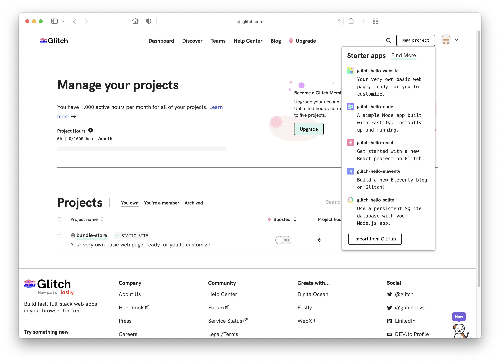

# Create Project

There will be a `New Project` button the top let. Create a new project and Select `glitch-hello-website`

This will load a new project:

Finally once loaded:

Look carefully at the page now - it is something like a web based IDE, with the project folder/files along the left and the selected file editable in the main panel. Select some of the files and look at their contents.

Along the end of the screen, locate and press the `Preview` button:

Then select `Preview in a new window`

This is now the public website - available across the web.

