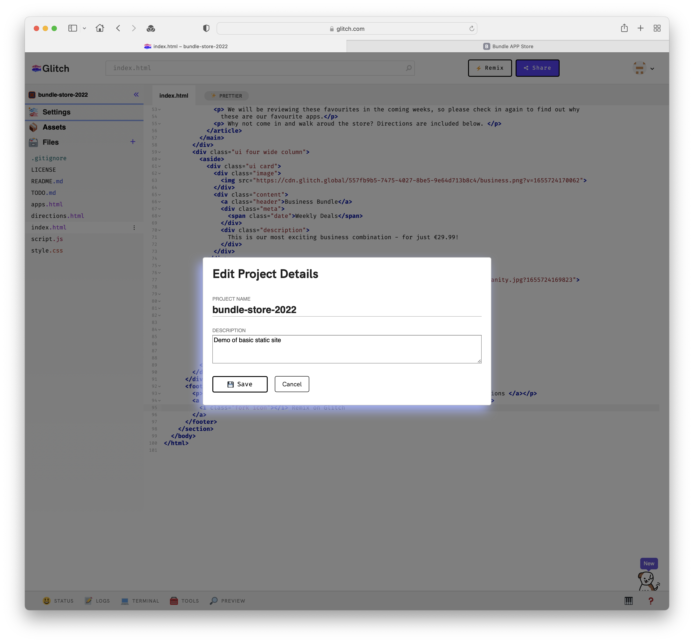
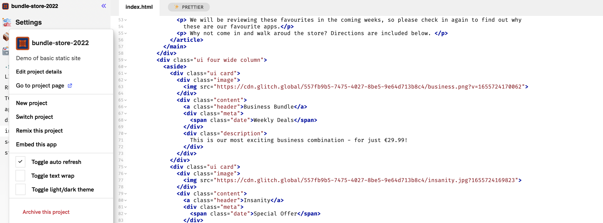
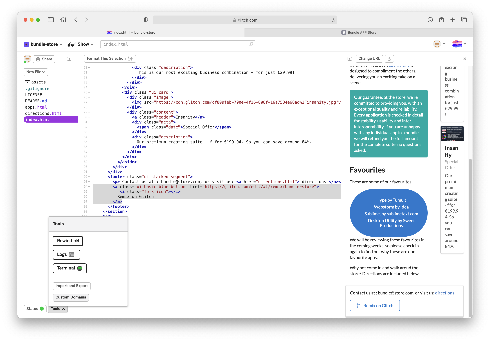
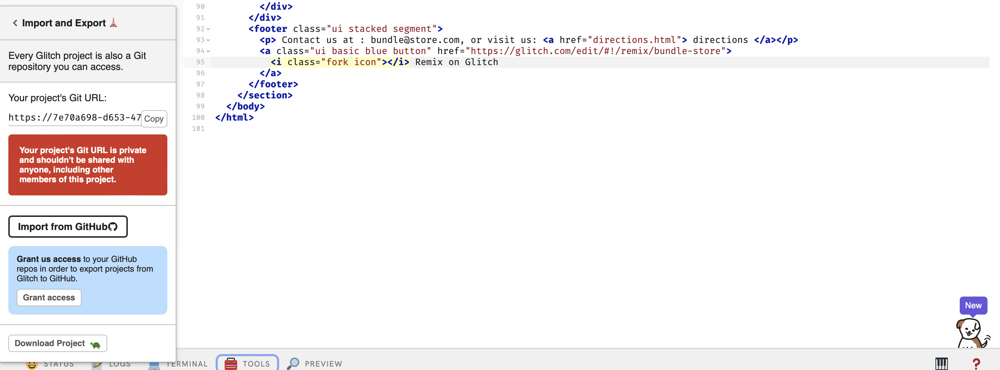
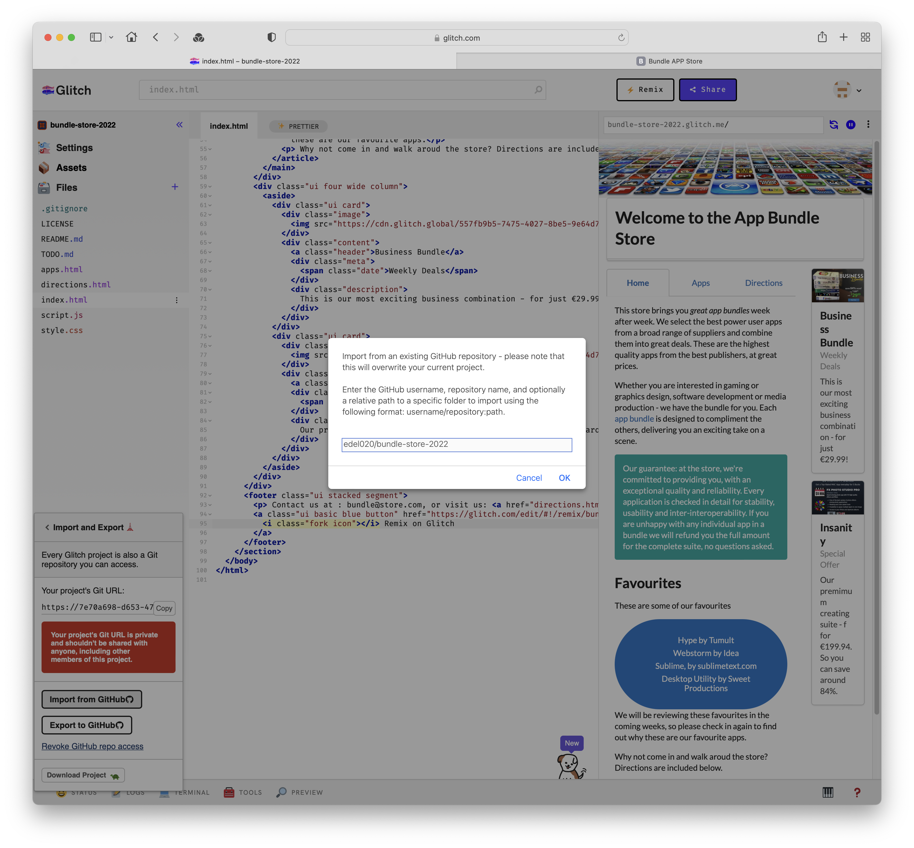
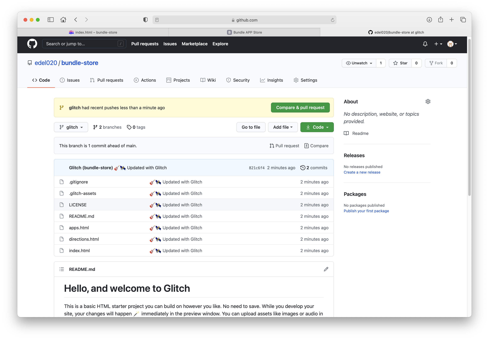

# Project Settings & Export

The project name can be changed via the Settings->Edit Project Details:

This will also change the project url, so if you have shared the app you will have to re-share the new url.

Another useful option on the Settings dialog is the `Toggle Auto Refresh`. 

The live app itself will not be refreshed until you re enable the option.

### Export

Explore the tools options:

Explore the `Tools->Export/Import` options

You can also just download a zip of the project

Glitch maintains an internal git version of the project. The Git URL  can be copied and you can 'clone' the project locally using the git command line:

~~~bash
git clone https://7e70a698-d653-4779-8d65-9f63f24de62f@api.glitch.com/git/bundle-store
~~~

You can also export to GitHub - experiment with this. You must specify your GitHub account name + the name of a repo that has already been created:

The project will, however, be on a different branch from master, so might not be visible at first unless you switch branches to `glitch`.

