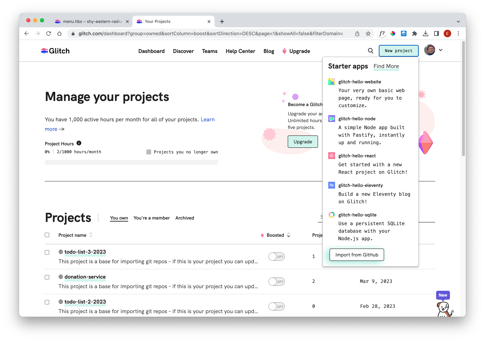
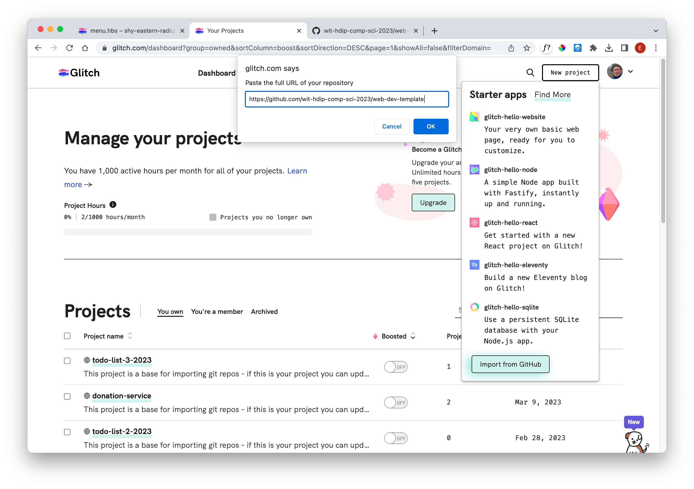
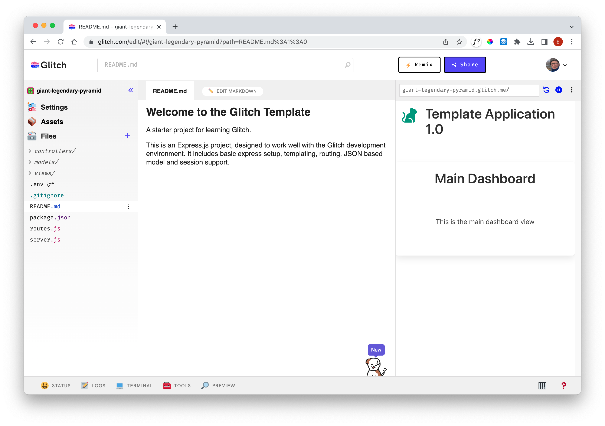
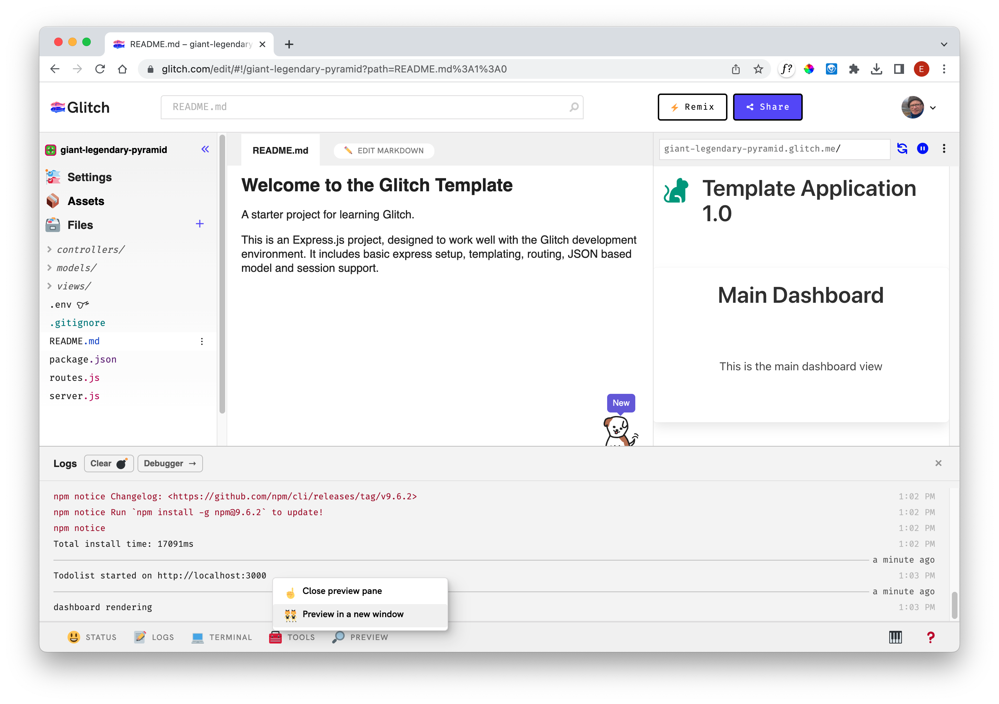
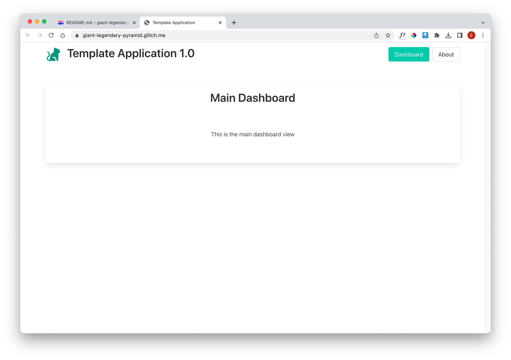
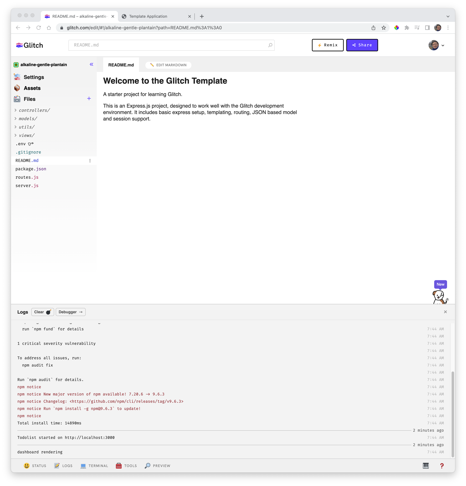

# Template 1

Create a new project in Glitch - selecting `Import from Github`:

In the subsequent dialog, enter this repo url:

~~~bash
https://github.com/wit-hdip-comp-sci-2023/web-dev-template
~~~

Press ok to import the project. After a minute or so, the application should look like this:

### View Logs

Now, select `Logs` (a button along the end of the screen), and turn on logs:

Now press the `Preview ->In a new Window` button

This should reveal the application running:

Explore the (small) number of views.

Back in the IDE, view the logs by selecting the "LOGS" button on the footer:

It is useful to keep this view on display if you have room on your screen.
