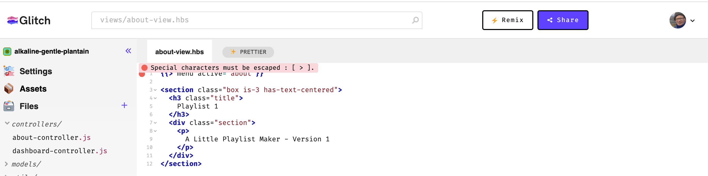

# Playlist

We are going to evolve this project into a simple playlist appication, enabling a user to create a playlist of songs. In this step, we will layout a static version.

First, we can make some simple changes to re brand the app as `Playlist 1` instead of `Template Application 1`

First replace the existing corresponding lines of code with each of the following in the views:

## views/partials/brand.hbs

~~~html
...
  
Playlist 1

...
~~~

## views/about-view.hbs

~~~html
{{> menu active="about"}}

<section class="box is-3 has-text-centered">
  <h3 class="title">
    Playlist 1
  </h3>
  

    

      A Little Playlist Maker - Version 1
    

  

</section>
~~~

Now to the controllers - adjust the viewData objects as shown:

## controllers/about-controller.js

~~~javascript
...
    const viewData = {
      title: 'About Playlist 1'
    };
...
~~~

## controllers/dashboard-controller.js

~~~javascript
...
    const viewData = {
      title: 'Playlist 1 Dashboard'
    };
...
~~~

Make sure the app is still running, but with the new branding. If there are errors, turn the logs and you may be able to see the source of the problem - which will usually be some small error in the javascript sources.

You may see this error when editing some templates/partials:

You can safely ignore this error, a result of an anomaly in Glitch.
