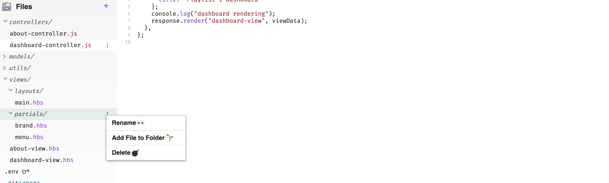
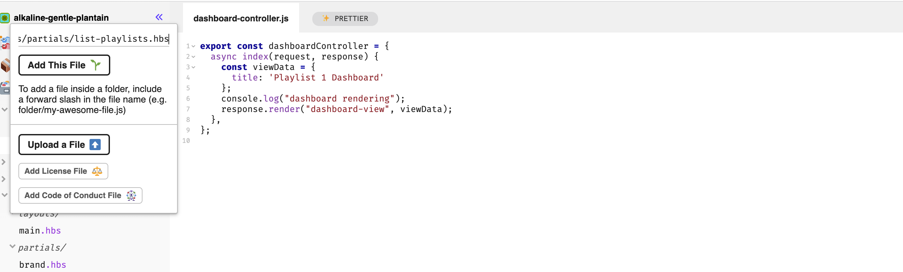
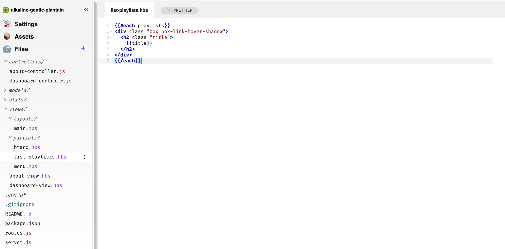
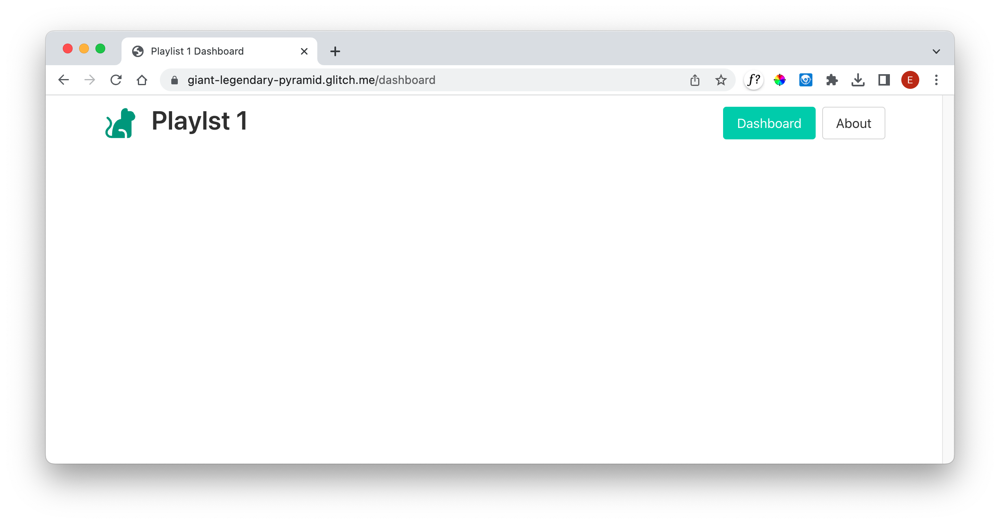

# List Playlists

We will introduce a new partial to list out all playlists:

## views/partials/list-playlists.hbs

~~~html
{{#each playlists}}

  <h2 class="title">
    {{title}}
  </h2>

{{/each}}
~~~

Files can be added by selecting the folder and pressing 'Add File to Folder' from a context menu:

Then press 'Add File to Folder' - and enter the name of the file `list-playlists.hbs`

The file can be edited now - enter the code above into here, I would recommend typing it manually as you will get more of a feel for the glitch editor and how it autocompletes: 

Replace the contents of dashboard.hbs with the following:

## views/dashboard-view.hbs

~~~html
{{> menu active="dashboard"}}

<section class="section">
  {{> list-playlists}}
</section>
~~~

Make sure the app runs successfully - the dashboard will not display any playlists yet:

