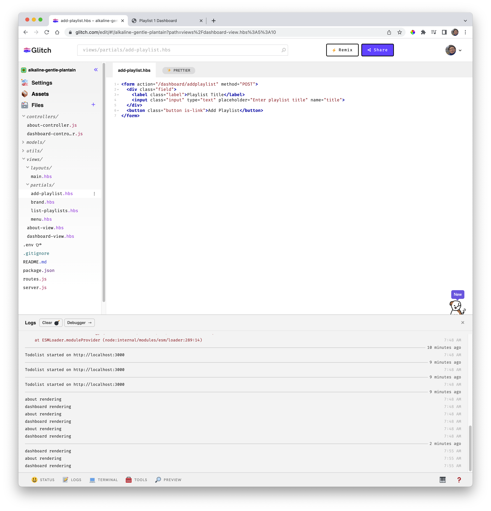
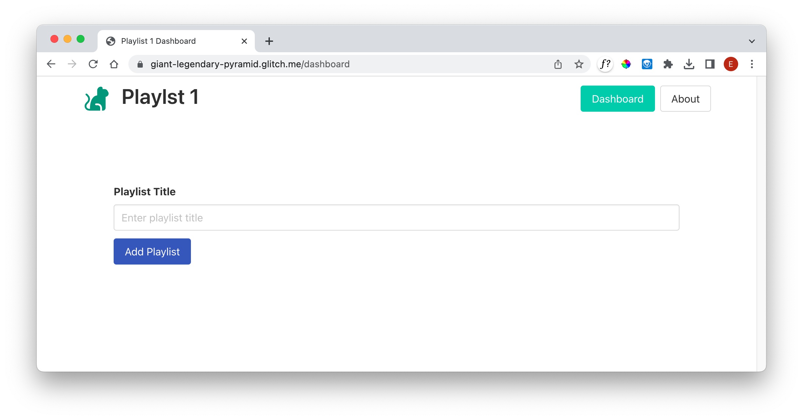
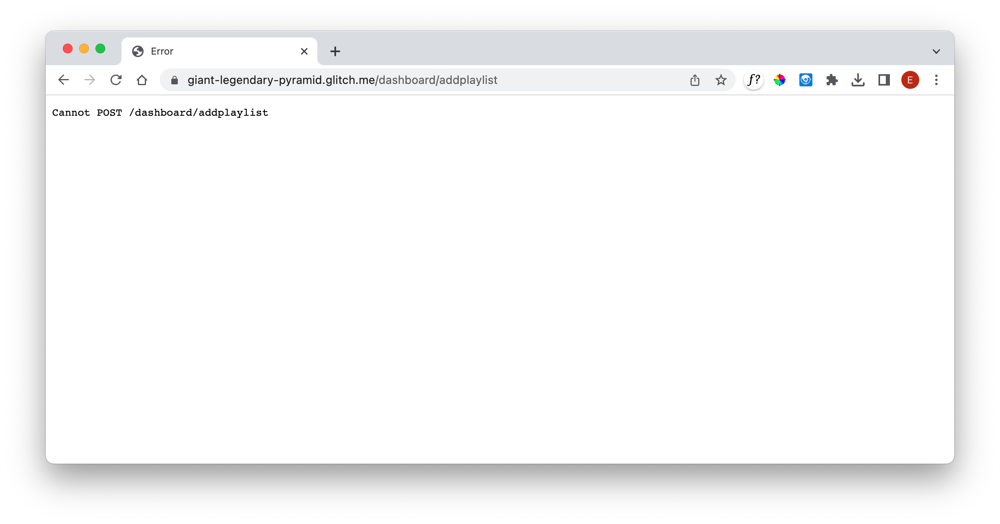

# Add Playlist

Bring in this new partial now:

## views/partials/add-playlist.hbs

~~~html
<form action="/dashboard/addplaylist" method="POST">
  

    <label class="label">Playlist Title</label>
    <input class="input" type="text" placeholder="Enter playlist title" name="title">
  

  <button class="button is-link">Add Playlist</button>
</form>
~~~

Include this new partial on the dashboard view

### views/dashboard-view.hbs

~~~handlebars
{{> menu active="dashboard"}}

<section class="section">
  {{> list-playlists}}
  {{> add-playlist}}
</section>
~~~

Refreshing the app now should display this form:

Attempting to add a playlist, however, will result in an error:

Note that clicking the button is submitting what you enter in the form the the server, glitch.

We will discuss forms at a later date but for now it will serve as a learning aid to use them this week and we can define them in our future lecture set.
