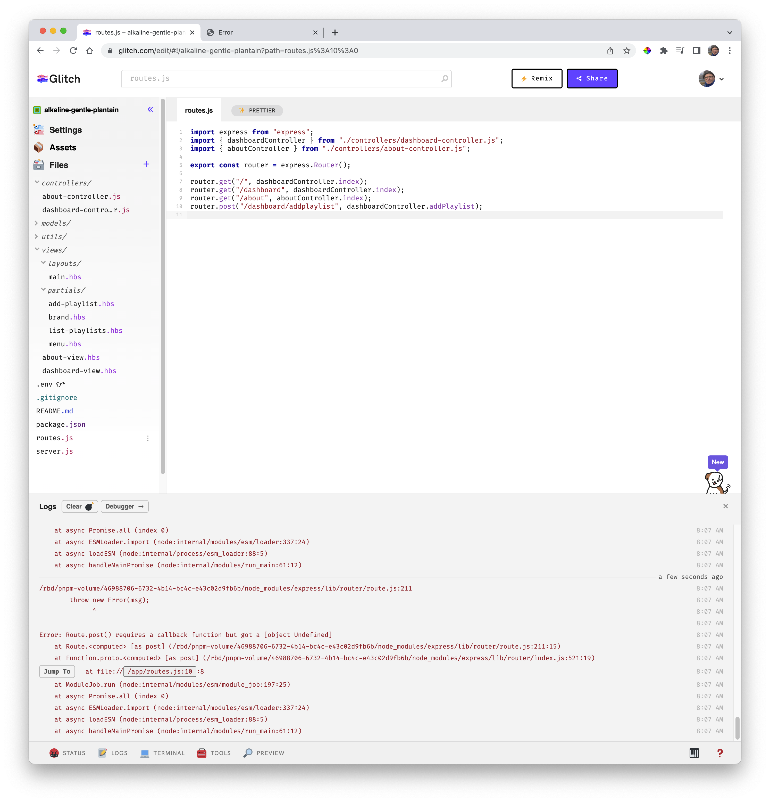
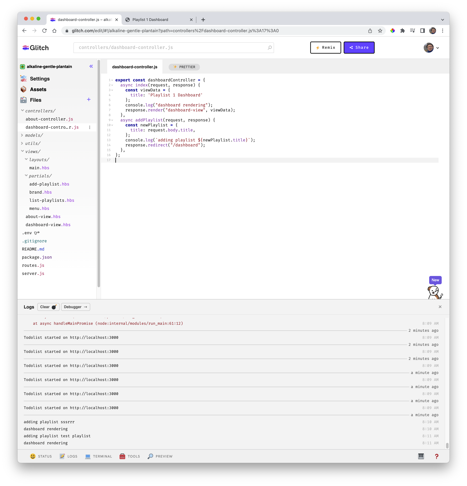

# Add Playlist Route + Action Method

Currently attempting to add a playlist produces an error:

This error is caused by the absence of a route to support this action.

We have a "routes.js" file, which we can augment with this new route:

### routes.js

~~~javascript
router.post("/dashboard/addplaylist", dashboardController.addPlaylist);
~~~

This will require a new function on the dashboardController:

### controllers/dashboard-controller.js

~~~javascript
...
  async addPlaylist(request, response) {
    const newPlaylist = {
      title: request.body.title,
    };
    console.log(`adding playlist ${newPlaylist.title}`);
    response.redirect("/dashboard");
  },
...    
~~~

You should be able to successfully add a playlist on the dashboard (without an error). However the playlist will not be displayed yet. However, the string you enter should appear in the logs.
