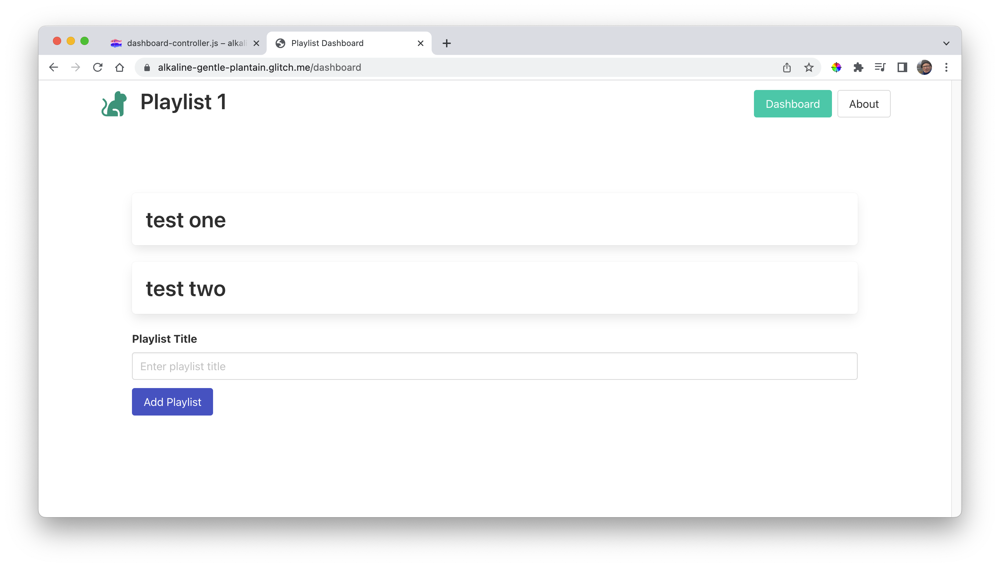

# Playlist Store

Currently our models folder contains this module:

~~~javascript
import { v4 } from "uuid";
import { initStore } from "../utils/store-utils.js";

const db = initStore("objects");

export const playlistStore = {
  async getAllObjects() {
    await db.read();
    return db.data.objects;
  },

  async addObject(object) {
    await db.read();
    playlist._id = v4();
    db.data.objects.push(object);
    await db.write();
    return object;
  },

  async getObjectById(id) {
    await db.read();
    const list = db.data.objects.find((object) => object._id === id);
    return list;
  },

  async deleteobjectById(id) {
    await db.read();
    const index = db.data.objects.findIndex((object) => object._id === id);
    db.data.objects.splice(index, 1);
    await db.write();
  },

  async deleteAllObjects() {
    db.data.objectss = [];
    await db.write();
  },
};
~~~

This is a placeholder for a simple data store implementation, enabling us to store/retrieve simple objects to a file. We don't need to fully understand how this works for the moment, but we will use it as an example for the models we wish to support.

Leave object-store in place, and introduce a new module in the same models folder:

### models/playlist-store.js

~~~javascript
import { v4 } from "uuid";
import { initStore } from "../utils/store-utils.js";

const db = initStore("playlists");

export const playlistStore = {
  async getAllPlaylists() {
    await db.read();
    return db.data.playlists;
  },

  async addPlaylist(playlist) {
    await db.read();
    playlist._id = v4();
    db.data.playlists.push(playlist);
    await db.write();
    return playlist;
  },

  async getPlaylistById(id) {
    await db.read();
    const list = db.data.playlists.find((playlist) => playlist._id === id);
    return list;
  },

  async deletePlaylistById(id) {
    await db.read();
    const index = db.data.playlists.findIndex((playlist) => playlist._id === id);
    db.data.playlists.splice(index, 1);
    await db.write();
  },

  async deleteAllPlaylists() {
    db.data.playlists = [];
    await db.write();
  },
};
~~~

Back in the dashboard-controller, import this module on the first line:

### Controllers/dashboard-controller.js

~~~javascript
import { playlistStore } from "../models/playlist-store.js";
~~~

Modify the addPlaylist function as follows:

~~~javascript
  async addPlaylist(request, response) {
    const newPlaylist = {
      title: request.body.title,
    };
    console.log(`adding playlist ${newPlaylist.title}`);
    await playlistStore.addPlaylist(newPlaylist);
    response.redirect("/dashboard");
  },
~~~

In the above we have a statement to add playlist:

~~~javascript
    await playlistStore.addPlaylist(newPlaylist);
~~~

Now to actually display the playlist once added. Rework the "index" method as follows:

~~~javascript
  async index(request, response) {
    const viewData = {
      title: "Playlist Dashboard",
      playlists: await playlistStore.getAllPlaylists(),
    };
    console.log("dashboard rendering");
    response.render("dashboard-view", viewData);
  },
~~~

This is the complete controller at this stage:

~~~javascript
import { playlistStore } from "../models/playlist-store.js";

export const dashboardController = {
  async index(request, response) {
    const viewData = {
      title: "Playlist Dashboard",
      playlists: await playlistStore.getAllPlaylists(),
    };
    console.log("dashboard rendering");
    response.render("dashboard-view", viewData);
  },
  
  async addPlaylist(request, response) {
    const newPlaylist = {
      title: request.body.title,
    };
    console.log(`adding playlist ${newPlaylist.title}`);
    await playlistStore.addPlaylist(newPlaylist);
    response.redirect("/dashboard");
  },
};
~~~

Trying it out now, we should see the playlists as they are added:

