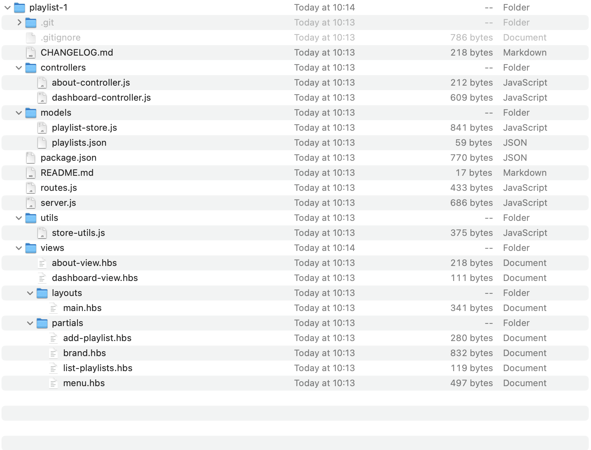
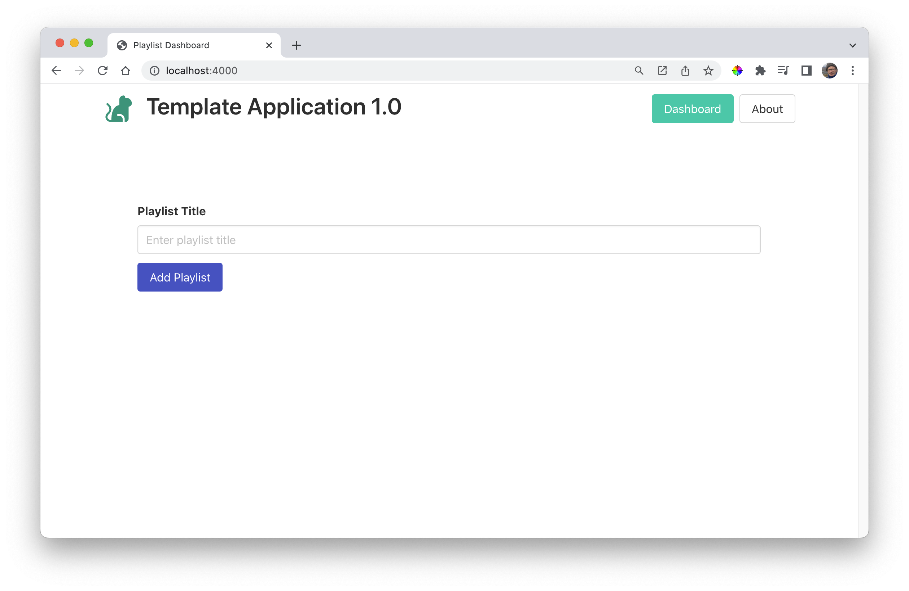

# Setup Project

Clone the sample solutions from the last lab:

~~~bash
git clone https://github.com/wit-hdip-comp-sci-2023/playlist-1.git
~~~

This will respond with:

~~~bash
Cloning into 'playlist-1'...
remote: Enumerating objects: 32, done.
remote: Counting objects: 100% (32/32), done.
remote: Compressing objects: 100% (26/26), done.
remote: Total 32 (delta 3), reused 32 (delta 3), pack-reused 0
Unpacking objects: 100% (32/32), done.
~~~

This will create a local copy of the project:

This is identical to the project we would have imported into Glitch.

When cloning a project like this - the first step is always to run the following command:

~~~bash
npm install
~~~

This `must` be run from *INSIDE* the project folder. This will respond with:

~~~bash
added 87 packages, and audited 88 packages in 3s

12 packages are looking for funding
  run `npm fund` for details

found 0 vulnerabilities
~~~

Also inside the folder, start the application like this:

~~~bash
npm start
~~~

This will respond with:

~~~bash
> playlist@0.1.0 start
> node server.js

Todolist started on http://localhost:4000
~~~

The application will now be running on:

- <http://localhost:4000/>

To stop the project, enter Ctrl-C in the terminal, returning the command prompt.

~~~bash

> playlist@0.1.0 start
> node server.js

Todolist started on http://localhost:4000
dashboard rendering
^C
$
~~~

