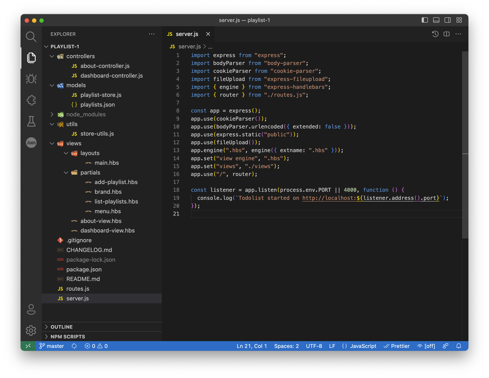
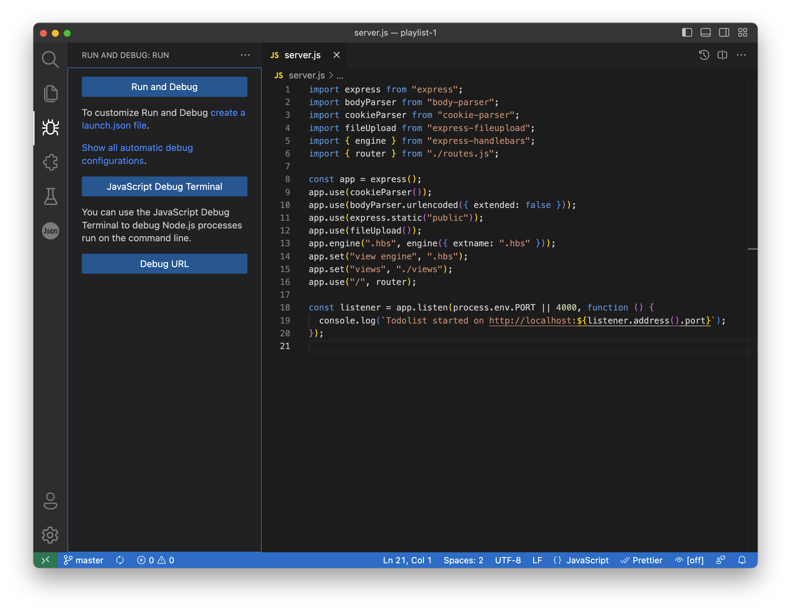
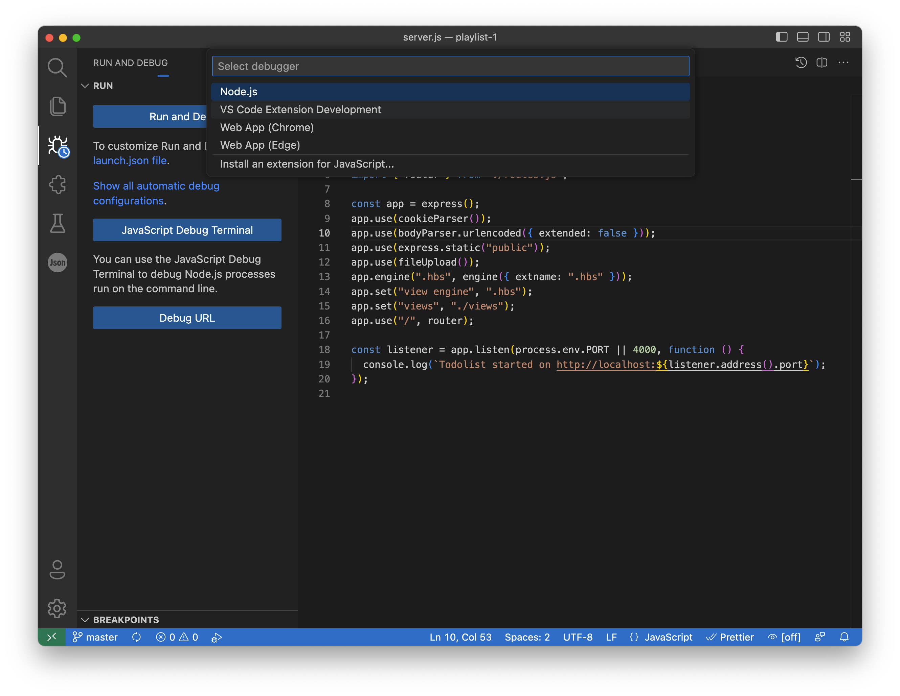
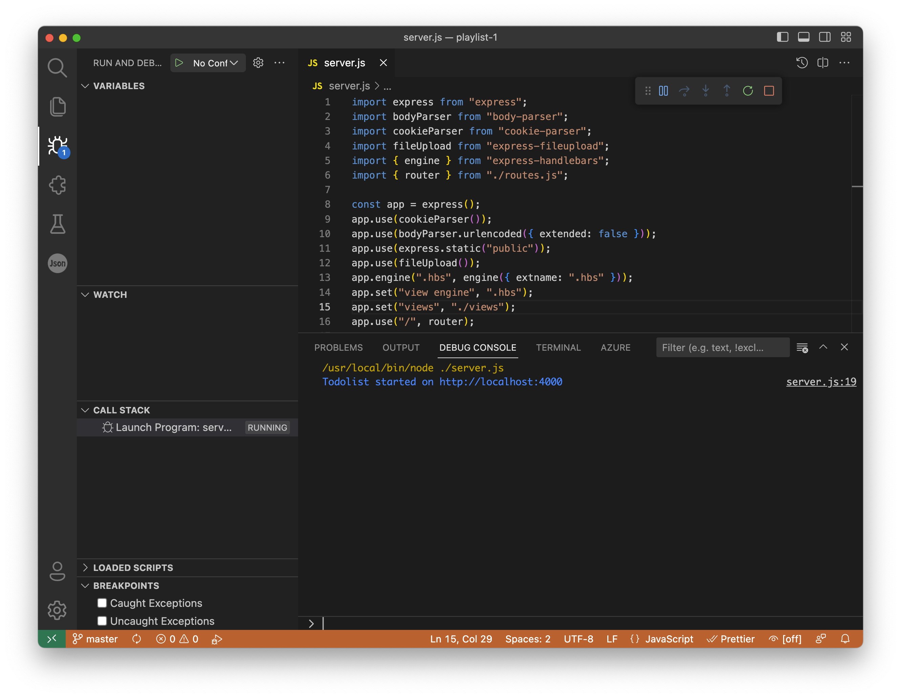
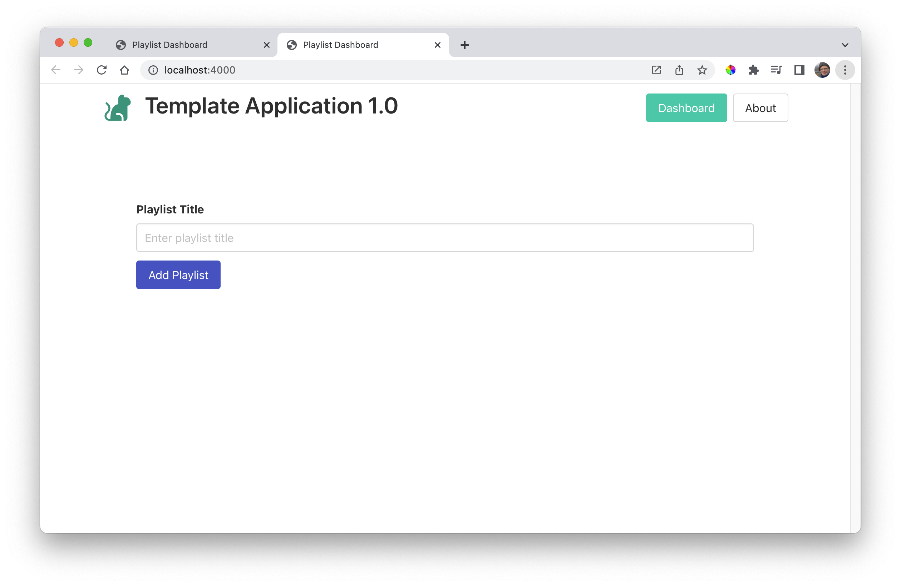
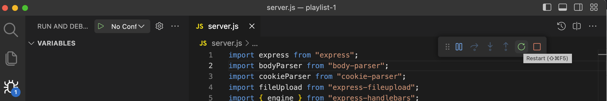

# VSCode

Launch VSCode, and use "File->Open Folder" to open the project:

Your version may not have the Lab and Json icons on the left (these are plugins), but it should have the other icons shown above.

Open server.js, and select the Bug - *Run & Debug* icon:

Press the "Run and Debug" button:

Select "Node.js" from the dropdown and press "Run & Debug" (again). The application should launch:

Notice that the bug icon has an indicator signifying a running app. If should now be running locally:

- <http://localhost:4000/>

You can stop the application (or restart it) via a new toolbar that should now be available:

