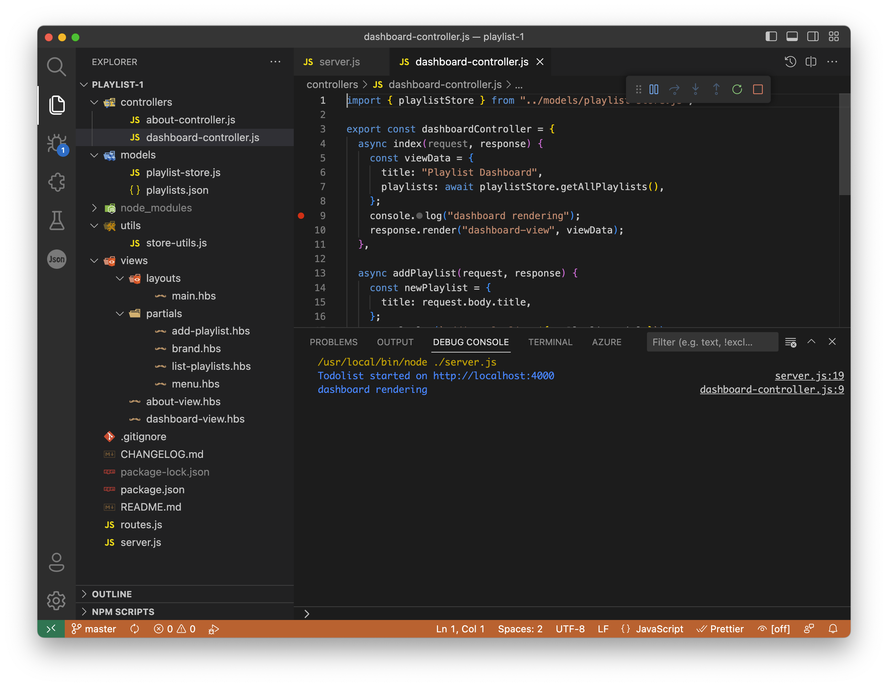
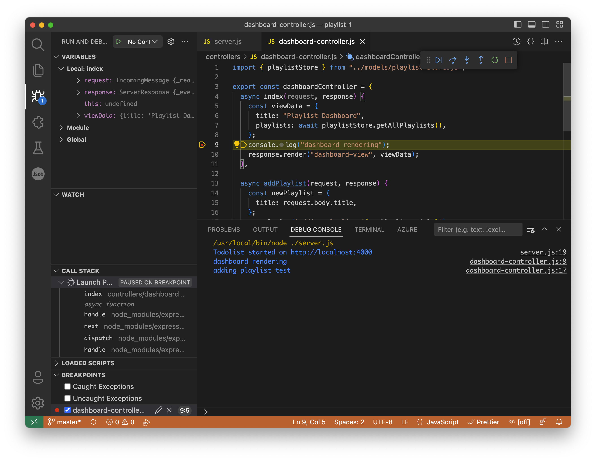
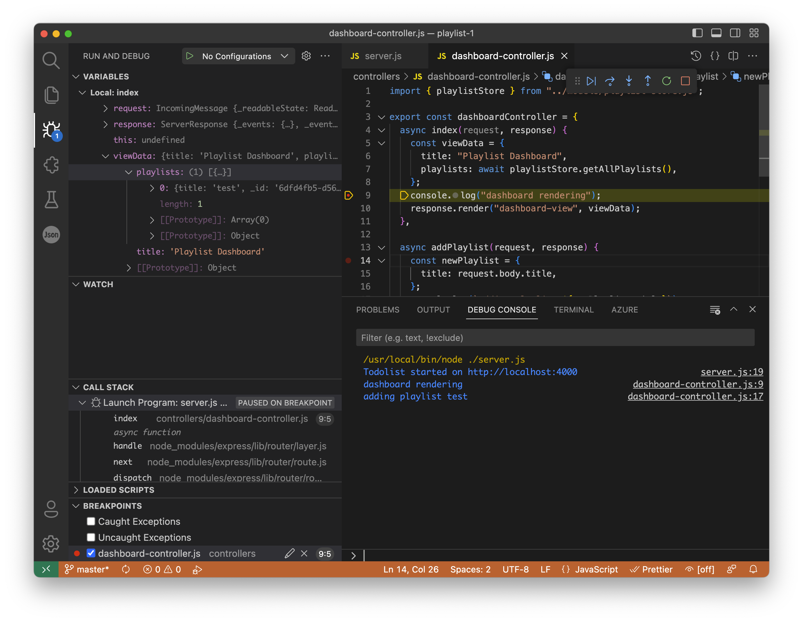
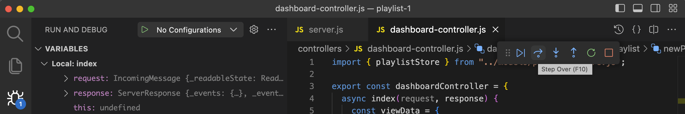

# Debug

One of the advantages of running the application in VSCode is the availability of a local debugger facility. This will allow you to single step through the application, exploring the data structures at any give point in the execution.

To try out, first set a 'breakpoint' somewhere you wish to explore. This is done by clicking in the left margin of a line of interest, causing a red dot to appear:

If the application is running, and you operate the Web UI such that this line of code will be executed, then the application will "Stop" at this point:

In the Variables pane, you can inspect memory at this point:

It can be challenging to see the wood from the trees - but you should be able to make out the playlist name ("test" above).

Explore the behaviour of the "Step Over" and "Step Into" buttons on the debug toolbar:

This can be difficult to get right - *Step Over* is your friend, as *Step Into* may take you into framework code. However you will need to use *Step Into* if the function you are calling is one of your own. Also, try out the "Continue" button. What does it do?
