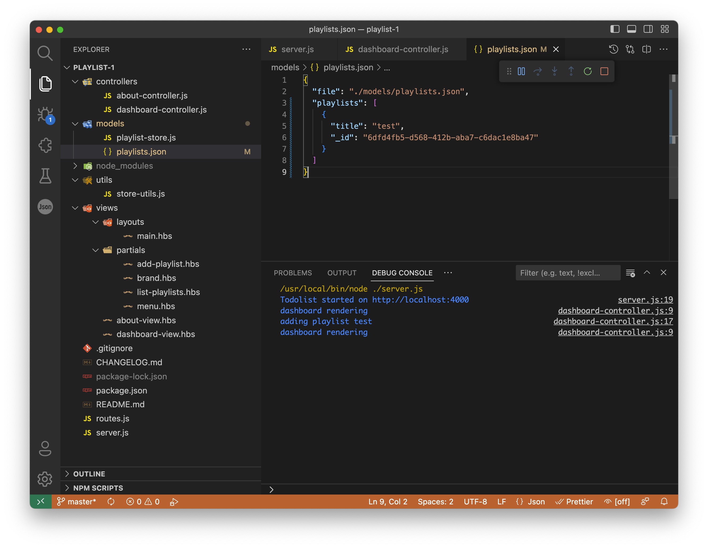

# Playlist Store

If you add a playlist, then you will notice that the models folder will contain a new file - playlists.json:

This will contain the playlists you have added:

~~~json
{
  "file": "./models/playlists.json",
  "playlists": [
    {
      "title": "test",
      "_id": "6dfd4fb5-d568-412b-aba7-c6dac1e8ba47"
    }
  ]
}
~~~

As you add playlists, they will appear in this file:

~~~json
{
  "file": "./models/playlists.json",
  "playlists": [
    {
      "title": "test",
      "_id": "6dfd4fb5-d568-412b-aba7-c6dac1e8ba47"
    },
    {
      "title": "another one",
      "_id": "491d2a1e-25c8-4468-acae-6936a19d20f2"
    }
  ]
}
~~~

This file is also present on the Glitch version, but will only appear after the project has been refreshed, or opened again having been closed. It is in fact there nevertheless, but a limitation in the Glitch UI means it doest not appear in updated form unless the project is closed and opened again.

