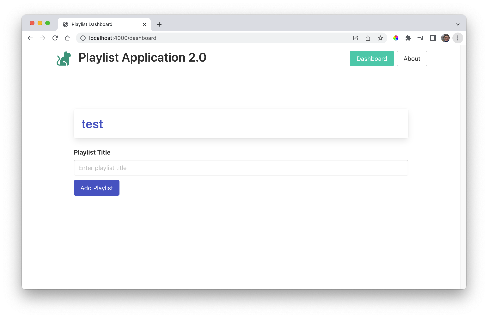
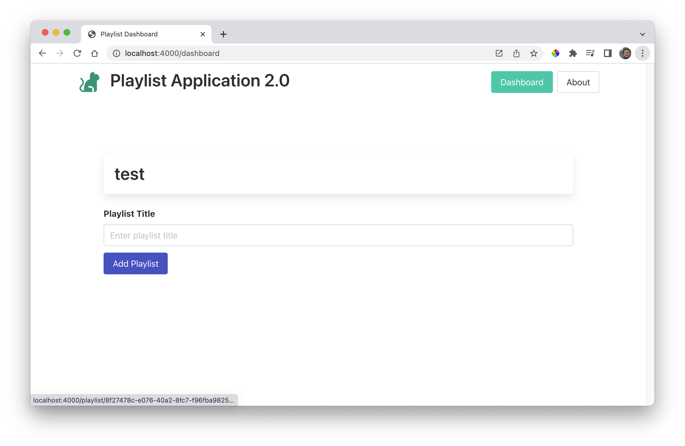
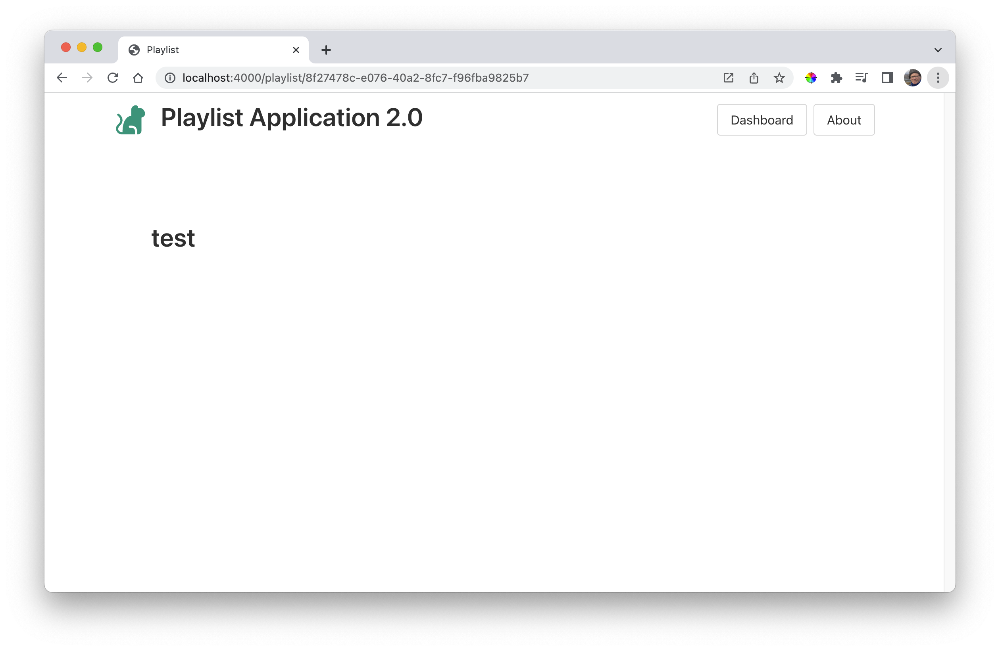

# Playlist Controller

Introduce a new module into the controller folder:

### controllers/playlist-controller.js

~~~javascript
import { playlistStore } from "../models/playlist-store.js";

export const playlistController = {
  async index(request, response) {
    const playlist = await playlistStore.getPlaylistById(request.params.id);
    const viewData = {
      title: "Playlist",
      playlist: playlist,
    };
    response.render("playlist-view", viewData);
  },
};
~~~

This will require a new view:

### views/playlist-view.hbs

~~~handlebars
{{> menu}}

<section class="section">
  

    {{playlist.title}}
  

</section>
~~~

To access this controller/view, we need a new route:

# routes.js

~~~javascript
import { playlistController } from "./controllers/playlist-controller.js";
...
...
router.get("/playlist/:id", playlistController.index);
~~~

This route is structured a little differently from the other routes - the route string contains a *variable* id:

~~~
/playlist/:id
~~~

This means the route, when accessed, will look like this:

~~~
/playlist/7f6ac366-a211-421f-81ce-4cc13be14120
~~~

I.e. the ":id" symbol will be replaced with the actual id (from the store) of a playlist.

Modify the list-playlists partial to include this id:

### views/partials/list-playlist.hbs

~~~handlebars
{{#each playlists}}

  <h2 class="title">
    <a href="/playlist/{{_id}}">
      {{title}}
    </a>
  </h2>

{{/each}}
~~~

Run the app now (or restart if it is already running) and add a playlist:

If you hover over the playlist name, you should see that it is a link:

Selecting the playlist name should load the new:

Press the Dashboard button to get back the main page for adding playlists.

