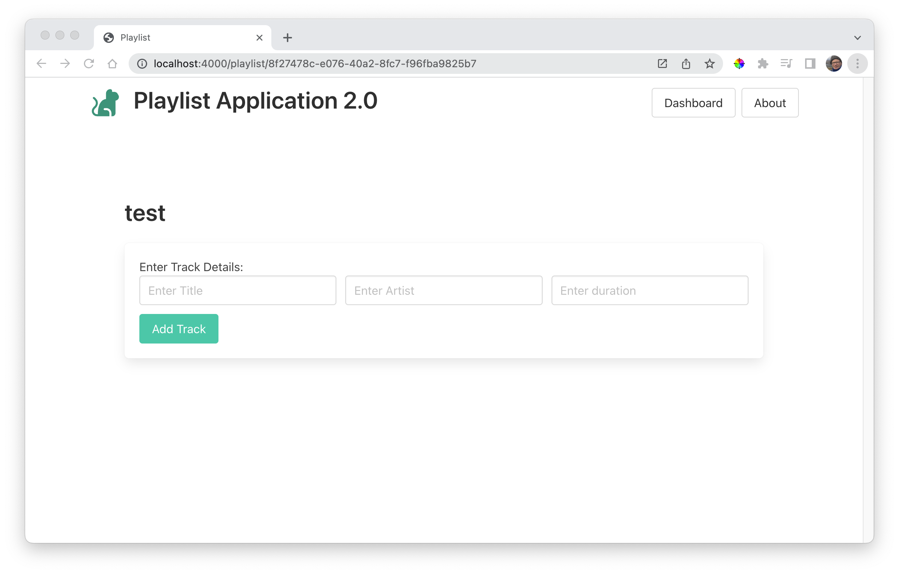
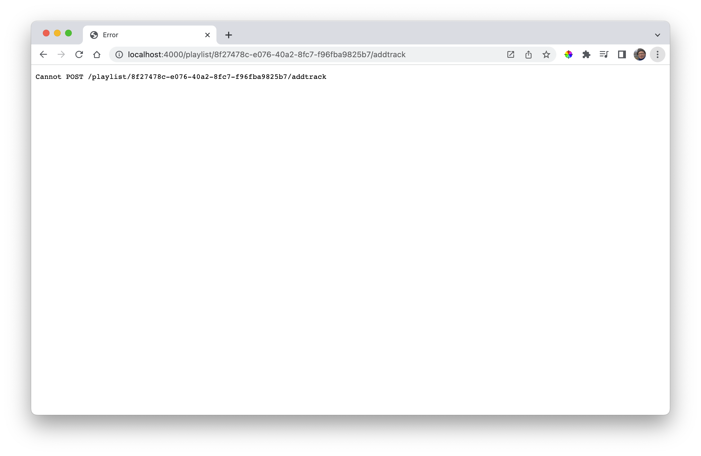

# Add Track

Adding a track will require a form to contain the track details.

~~~handlebars
<form class="box" action="/playlist/{{playlist._id}}/addtrack" method="POST">
  <label>Enter Track Details:</label>
  

    

      

        <input class="input" type="text" placeholder="Enter Title" name="title">
      

      

        <input class="input" type="text" placeholder="Enter Artist" name="artist">
      

      

        <input class="input" type="text" placeholder="Enter duration" name="duration">
      

    

  

  <button class="button is-primary">Add Track</button>
</form>
~~~

This should be included in the playlist view:

### views/playlist-view.hbs

~~~handlebars
{{> menu}}

<section class="section">
  

    {{playlist.title}}
  

  {{> add-track}}
</section>
~~~

Opening a playlist should now look like this:

The form is in place - but the Add Track button causes an error:

This is because we have no matching route yet.
