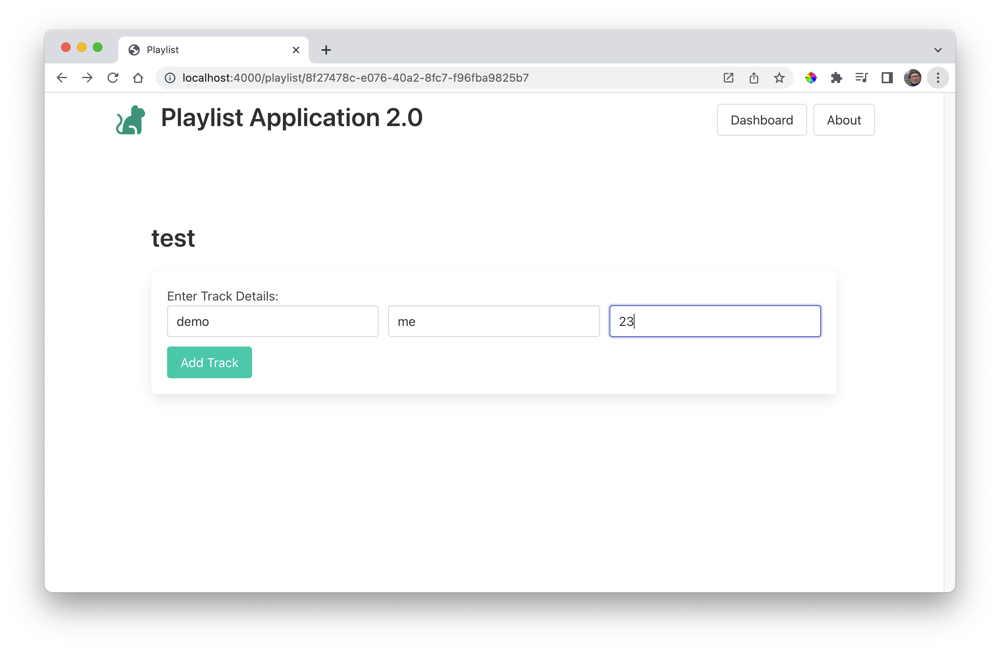
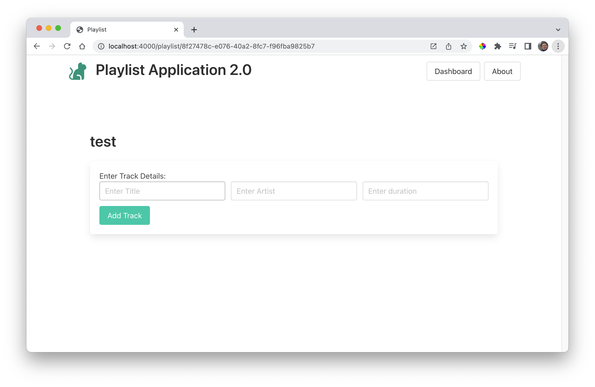

# Add Playlist Route

Introduce this new route:

~~~javascript
router.post("/playlist/:id/addtrack", playlistController.addTrack);
~~~

This route contains the id of the playlist we want to add a track to, for example:

~~~
http://localhost:4000/playlist/8f27478c-e076-40a2-8fc7-f96fba9825b7/addtrack
~~~

Note that the route refers to a new function "addTrack", in playlistController. Introduce this now:

### controllers/playlist-controller.js

~~~javascript
import { trackStore } from "../models/track-store.js";
...
...

  async addTrack(request, response) {
    const playlist = await playlistStore.getPlaylistById(request.params.id);
    const newTrack = {
      title: request.body.title,
      artist: request.body.artist,
      duration: Number(request.body.duration),
    };
    console.log(`adding track ${newTrack.title}`);
    await trackStore.addTrack(playlist._id, newTrack);
    response.redirect("/playlist/" + playlist._id);
  },
~~~

This is the complete controller:

~~~javascript
import { playlistStore } from "../models/playlist-store.js";
import { trackStore } from "../models/track-store.js";

export const playlistController = {
  async index(request, response) {
    const playlist = await playlistStore.getPlaylistById(request.params.id);
    const viewData = {
      title: "Playlist",
      playlist: playlist,
    };
    response.render("playlist-view", viewData);
  },

  async addTrack(request, response) {
    const playlist = await playlistStore.getPlaylistById(request.params.id);
    const newTrack = {
      title: request.body.title,
      artist: request.body.artist,
      duration: Number(request.body.duration),
    };
    console.log(`adding track ${newTrack.title}`);
    await trackStore.addTrack(playlist._id, newTrack);
    response.redirect("/playlist/" + playlist._id);
  },
};
~~~

Restarting the app (automatic on Glitch, manually on VSCode), should allow you to add tracks to a playlist.:

Pressing 'Add Track' will clear the track, but not add it to the view:

If you are running VSCode, you will be able to see a new tracks.json file generated containing the track:

### Models/tracks.json

~~~json
{
  "file": "./models/tracks.json",
  "tracks": [
    {
      "title": "demo",
      "artist": "me",
      "duration": 23,
      "_id": "5a78c5c6-e100-4524-b116-f8a6243501be",
      "playlistid": "8f27478c-e076-40a2-8fc7-f96fba9825b7"
    }
  ]
}
~~~

The playlist above should correspond with the playlist in playlists.json

~~~json
{
  "file": "./models/playlists.json",
  "playlists": [
    {
      "title": "test",
      "_id": "8f27478c-e076-40a2-8fc7-f96fba9825b7"
    }
  ]
}
~~~

