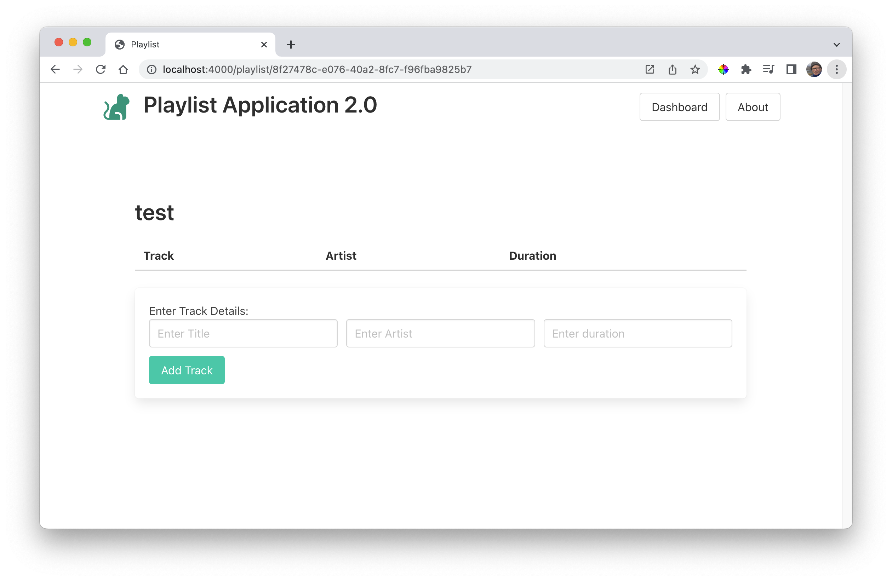
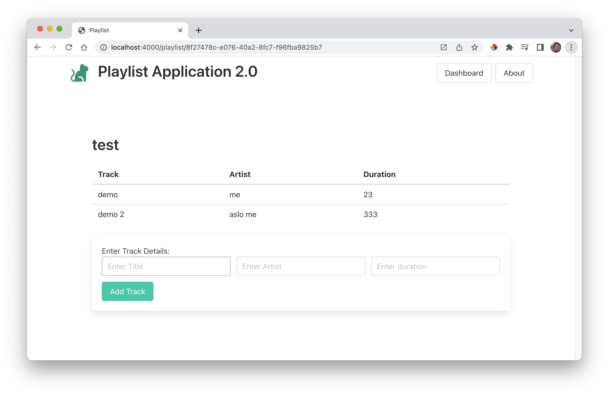

### List Tracks

The last piece of the puzzle is to list the tracks as they are added to the playlist:

### views/partials/list-tracks.hbs

~~~handlebars
<table class="table is-fullwidth">
  <thead>
    <tr>
      <th>Track</th>
      <th>Artist</th>
      <th>Duration</th>
    </tr>
  </thead>
  <tbody>
    {{#each playlist.tracks}}
    <tr>
      <td>
        {{title}}
      </td>
      <td>
        {{artist}}
      </td>
      <td>
        {{duration}}
      </td>
    </tr>
    {{/each}}
  </tbody>
</table>
~~~

We include this in the playlist-view:

### views/playlist-view.hbs

~~~handlebars
{{> menu}}

<section class="section">
  

    {{playlist.title}}
  

  {{> list-tracks}}
  {{> add-track}}
</section>
~~~

Restarting the app now, and adding a track to a playlist should look like this:

Not quite what we were expecting. We need one more change. Currently, in the playlist controller index method we are getting the playlist correctly:

~~~javascript
  async index(request, response) {
    const playlist = await playlistStore.getPlaylistById(request.params.id);
    const viewData = {
      title: "Playlist",
      playlist: playlist,
    };
    response.render("playlist-view", viewData);
  },
~~~

But it seems to have no tracks, even though we seem to have added them. We can fix this in the playlist-store. Currently we have this method:

### Models/playlist-store.js

~~~javascript
  async getPlaylistById(id) {
    await db.read();
    const list = db.data.playlists.find((playlist) => playlist._id === id);
    return list;
  },
~~~

Modify as follows:

~~~javascript
// new import at the top
import { trackStore } from "./track-store.js";
...
  async getPlaylistById(id) {
    await db.read();
    const list = db.data.playlists.find((playlist) => playlist._id === id);
    list.tracks = await trackStore.getTracksByPlaylistId(list._id);
    return list;
  },
...
~~~

In the above we are including all the tracks (with the playlist id) in the object returned by the method.

This should work now:

