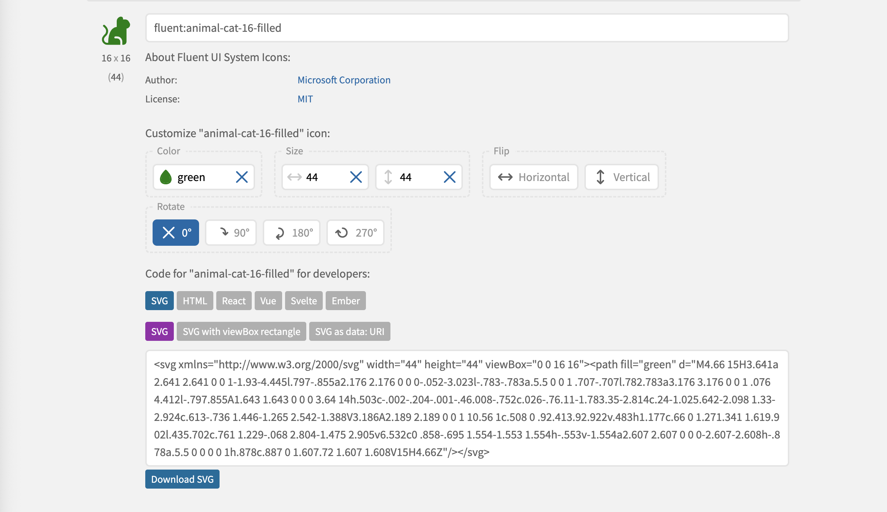

### Icons

Icons are a useful way of communicating UX features. We will use some icons in this lab as buttons for some common tasks.

We already have an icon in our brand partial:

### view/partials/brand.hbs

~~~handlebars

  <svg width="44" height="44" fill="none" viewBox="0 0 24 24" xmlns="http://www.w3.org/2000/svg">
    <path
      d="M7.247 22H5.796a3.797 3.797 0 0 1-2.775-6.39l1.135-1.217a3.059 3.059 0 0 0-.073-4.248L2.969 9.03a.75.75 0 0 1 1.06-1.06l1.114 1.114a4.558 4.558 0 0 1 .11 6.332l-1.136 1.217a2.3 2.3 0 0 0 1.68 3.867h.677c-.003-.285-.001-.634.012-1.033.036-1.083.157-2.542.5-4.012.34-1.462.915-2.996 1.899-4.177.872-1.047 2.055-1.801 3.61-1.985V5.15A3.15 3.15 0 0 1 15.641 2c.746 0 1.35.604 1.35 1.35V4h1.636c.95 0 1.834.492 2.335 1.3l.62 1c1.092 1.763-.084 4.02-2.093 4.19v9.26A2.25 2.25 0 0 1 17.242 22h-.75v-2.25A3.749 3.749 0 0 0 12.744 16h-1.25a.75.75 0 0 0 0 1.5h1.25a2.25 2.25 0 0 1 2.249 2.25V22H7.247Z"
      fill="#1CA085" />
  </svg>
  
Playlist Application 3.0

~~~

This icon, and many thousands more can be sourced here:

- <https://iconify.design/>

This is the particular icon above:

- <https://icon-sets.iconify.design/fluent/animal-cat-16-filled/>

You can specify icon colour and dimensions:

... and then copy the icon directly into a partial.

Create a new folder in the partials folder, and place the 'brand' icon into its own file:

### views/partials/icons/logo.hbs

~~~handlebars
<svg width="44" height="44" fill="none" viewBox="0 0 24 24" xmlns="http://www.w3.org/2000/svg">
  <path
    d="M7.247 22H5.796a3.797 3.797 0 0 1-2.775-6.39l1.135-1.217a3.059 3.059 0 0 0-.073-4.248L2.969 9.03a.75.75 0 0 1 1.06-1.06l1.114 1.114a4.558 4.558 0 0 1 .11 6.332l-1.136 1.217a2.3 2.3 0 0 0 1.68 3.867h.677c-.003-.285-.001-.634.012-1.033.036-1.083.157-2.542.5-4.012.34-1.462.915-2.996 1.899-4.177.872-1.047 2.055-1.801 3.61-1.985V5.15A3.15 3.15 0 0 1 15.641 2c.746 0 1.35.604 1.35 1.35V4h1.636c.95 0 1.834.492 2.335 1.3l.62 1c1.092 1.763-.084 4.02-2.093 4.19v9.26A2.25 2.25 0 0 1 17.242 22h-.75v-2.25A3.749 3.749 0 0 0 12.744 16h-1.25a.75.75 0 0 0 0 1.5h1.25a2.25 2.25 0 0 1 2.249 2.25V22H7.247Z"
    fill="#1CA085" />
</svg>
~~~

We can then simplify brand.hbs to include this:

### views/partials/brand.hbs

~~~handlebars

  {{>icons/logo }}
  
Playlist Application 3.0

~~~

Now lets introduce some more icons.

## Delete & Open

Search for and locate a suitable delete and open icons:

- https://icon-sets.iconify.design/?query=delete

- https://icon-sets.iconify.design/?query=open

For example:

### views/partials/icons/delete.hbs

~~~handlebars
<svg width="24" height="24" fill="none" viewBox="0 0 24 24" xmlns="http://www.w3.org/2000/svg">
  <path
    d="M21.5 6a1 1 0 0 1-.883.993L20.5 7h-.845l-1.231 12.52A2.75 2.75 0 0 1 15.687 22H8.313a2.75 2.75 0 0 1-2.737-2.48L4.345 7H3.5a1 1 0 0 1 0-2h5a3.5 3.5 0 1 1 7 0h5a1 1 0 0 1 1 1Zm-7.25 3.25a.75.75 0 0 0-.743.648L13.5 10v7l.007.102a.75.75 0 0 0 1.486 0L15 17v-7l-.007-.102a.75.75 0 0 0-.743-.648Zm-4.5 0a.75.75 0 0 0-.743.648L9 10v7l.007.102a.75.75 0 0 0 1.486 0L10.5 17v-7l-.007-.102a.75.75 0 0 0-.743-.648ZM12 3.5A1.5 1.5 0 0 0 10.5 5h3A1.5 1.5 0 0 0 12 3.5Z"
    fill="#1CA085" />
</svg>
~~~

### views/partials/icons/open.hbs

~~~handlebars
<svg width="24" height="24" fill="none" viewBox="0 0 24 24" xmlns="http://www.w3.org/2000/svg">
  <path
    d="M6.25 4.75a1.5 1.5 0 0 0-1.5 1.5v11.5a1.5 1.5 0 0 0 1.5 1.5h11.5a1.5 1.5 0 0 0 1.5-1.5v-4a1 1 0 1 1 2 0v4a3.5 3.5 0 0 1-3.5 3.5H6.25a3.5 3.5 0 0 1-3.5-3.5V6.25a3.5 3.5 0 0 1 3.5-3.5h4a1 1 0 1 1 0 2h-4Zm6.5-1a1 1 0 0 1 1-1h6.5a1 1 0 0 1 1 1v6.5a1 1 0 1 1-2 0V6.164l-4.793 4.793a1 1 0 1 1-1.414-1.414l4.793-4.793H13.75a1 1 0 0 1-1-1Z"
    fill="#1CA085" />
</svg>
~~~

