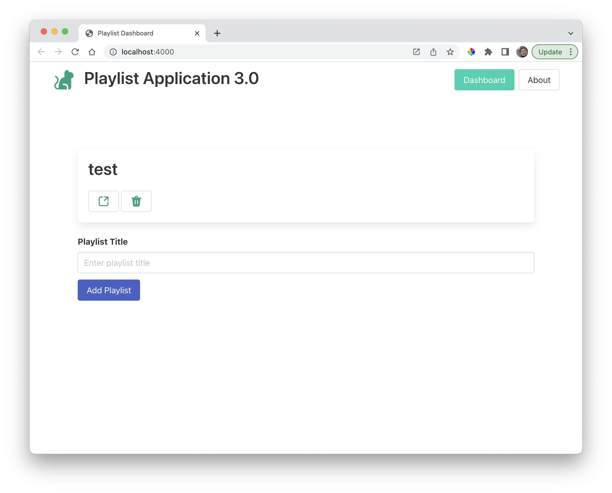

# Icon Buttons

Modify the list-playlists.hbs partial as follows:

~~~handlebars
{{#each playlists}}

  <h2 class="title">
    {{title}}
  </h2>
  <a href="/playlist/{{_id}}" class="button">
    {{>icons/open}}
  </a>

{{/each}}
~~~

This remove the link from the playlist title, including the link on an icon:

This should open the playlist when selected.

### Delete Button

Introduce another button:

~~~handlebars
{{#each playlists}}

  <h2 class="title">
    {{title}}
  </h2>
  <a href="/playlist/{{_id}}" class="button">
    {{>icons/open}}
  </a>
  <a href="/dashboard/deleteplaylist/{{_id}}" class="button">
    {{>icons/delete}}
  </a>

{{/each}}
~~~

