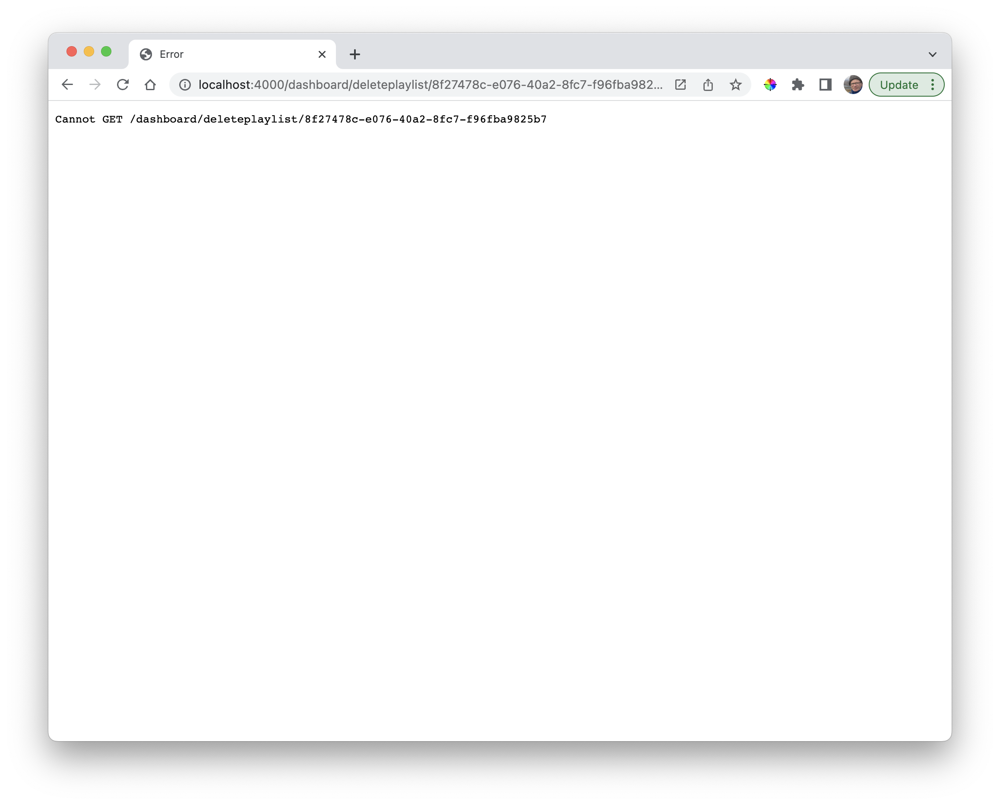

### Delete Playlist 

Currently the delete playlist button produces an error:

To implement delete, we move through the familiar pattern:

- Define a new route
- Implement a new controller method to handle the route
- In the new controller method, update the model

### routes.js

~~~javascript
router.get("/dashboard/deleteplaylist/:id", dashboardController.deletePlaylist);
~~~

### controllers/dashboard-controller.js

~~~javascript
  async deletePlaylist(request, response) {
    console.log(`Deleting Playlist called`);

    response.redirect("/dashboard");
  },
~~~

The route should work now, and the log statement above should be visible in the logs.

To complete the implementation:

~~~javascript
  async deletePlaylist(request, response) {
    const playlistId = request.params.id;
    console.log(`Deleting Playlist ${playlistId}`);
    await playlistStore.deletePlaylistById(playlistId);
    response.redirect("/dashboard");
  },
~~~

Delete should function as expected now.
