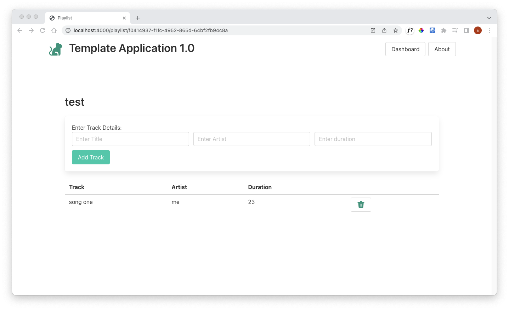

# Delete Track

Extend the tracks view to include a delete button:

### views/partials/list-tracks.hbs

~~~handlebars
<table class="table is-fullwidth">
  <thead>
    <tr>
      <th>Track</th>
      <th>Artist</th>
      <th>Duration</th>
      <th></th>
    </tr>
  </thead>
  <tbody>
    {{#each playlist.tracks}}
    <tr>
      <td>
        {{title}}
      </td>
      <td>
        {{artist}}
      </td>
      <td>
        {{duration}}
      </td>
      <td>
        <a href="/playlist/{{../playlist._id}}/deletetrack/{{_id}}" class="button">
          {{>icons/delete}}
        </a>
      </td>
    </tr>
    {{/each}}
  </tbody>
</table>
~~~

The structure of the url in the delete route is a little unusual:

~~~handlebars
        <a href="/playlist/{{../playlist._id}}/deletetrack/{{_id}}" class="button">
~~~

The first variable segment includes a "../" prefix. This reaches into the current context and 'ascends' to its parent data structure, accessing the _id field. This syntax is not used often, but is occasionally necessary for nested data structure like this.

This is the route implementation:

### routes.js

~~~javascript
router.get("/playlist/:playlistid/deletetrack/:trackid", playlistController.deleteTrack);
~~~

### controllers/playlist-controller.js

~~~javascript
  async deleteTrack(request, response) {
    const playlistId = request.params.playlistid;
    const trackId = request.params.trackid;
    console.log(`Deleting Track ${trackId} from Playlist ${playlistId}`);
    await trackStore.deleteTrack(request.params.trackId);
    response.redirect("/playlist/" + playlistId);
  },
~~~

This should work now.
