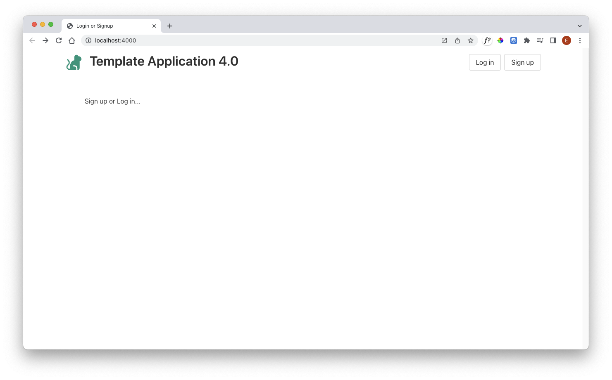
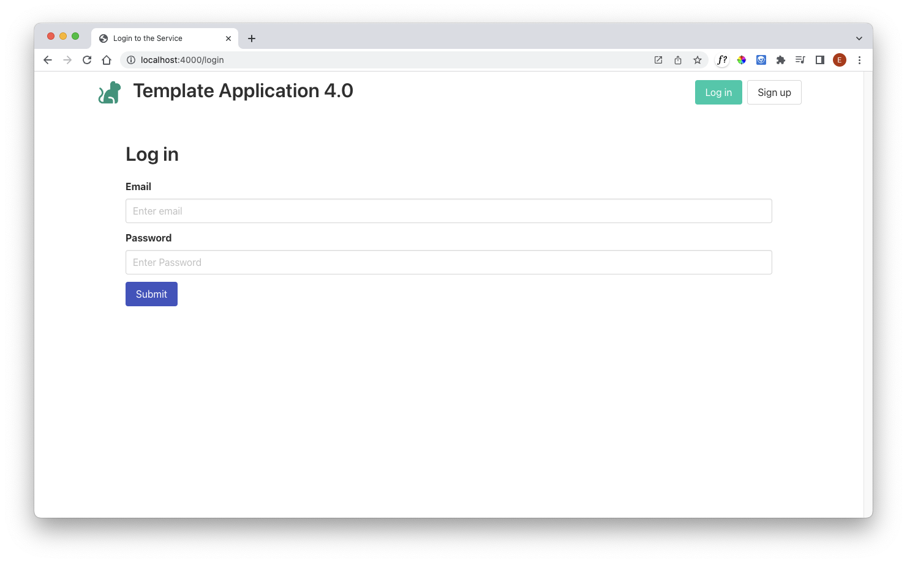
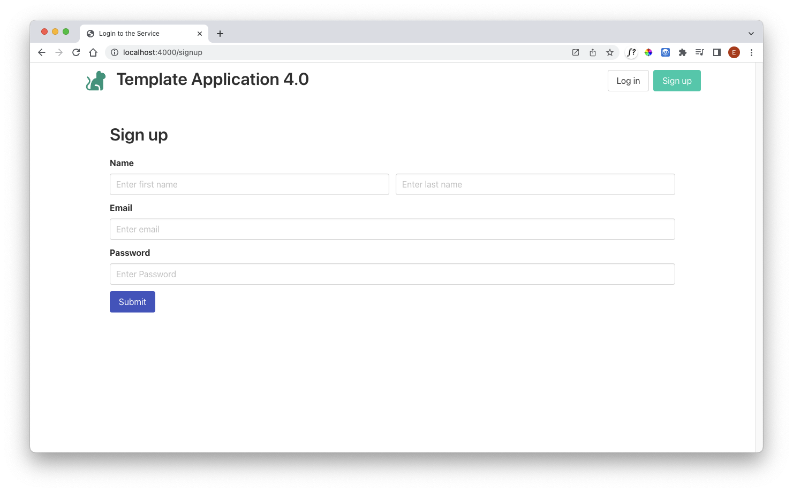

# Routes

To support the users, we need a new set of routes:

## routes.js

First, import the accounts module towards the top if the routes file:

~~~javascript
...
import { accountsController } from './controllers/accounts-controller.js';
...
~~~

Then we can append these new routes:

~~~javascript
...
router.get("/", accountsController.index);
router.get("/login", accountsController.login);
router.get("/signup", accountsController.signup);
router.get("/logout", accountsController.logout);
router.post("/register", accountsController.register);
router.post("/authenticate", accountsController.authenticate);
...
~~~

We also need to remove this existing route, as we are replacing it:

~~~javascript
router.get("/", dashboard.index);
~~~

This is the complete revised routes.js

~~~javascript
import express from "express";
import { accountsController } from "./controllers/accounts-controller.js";
import { dashboardController } from "./controllers/dashboard-controller.js";
import { playlistController } from "./controllers/playlist-controller.js";
import { aboutController } from "./controllers/about-controller.js";

export const router = express.Router();

router.get("/", accountsController.index);
router.get("/login", accountsController.login);
router.get("/signup", accountsController.signup);
router.get("/logout", accountsController.logout);
router.post("/register", accountsController.register);
router.post("/authenticate", accountsController.authenticate);

router.get("/dashboard", dashboardController.index);
router.post("/dashboard/addplaylist", dashboardController.addPlaylist);
router.get("/dashboard/deleteplaylist/:id", dashboardController.deletePlaylist);
router.get("/playlist/:id", playlistController.index);
router.post("/playlist/:id/addtrack", playlistController.addTrack);
router.get("/playlist/:playlistid/deletetrack/:trackid", playlistController.deleteTrack);
router.get("/about", aboutController.index);
~~~

Finally, in order to support the logout feature, we need to add a new option to the main menu:

## views/partials/menu.hbs

~~~javascript
<nav class="navbar mb-6">
  

    {{> brand}}
  

  

    

      

        

          <a id="dashboard" class="button" href="/dashboard"> Dashboard </a>
          <a id="about" class="button" href="/about"> About </a>
          <a id="logout" class="button" href="/logout"> Logout </a>
        

      

    

  

</nav>

~~~

The application should be running now. You should see these new views:

### A new landing page

### Signup

### login

