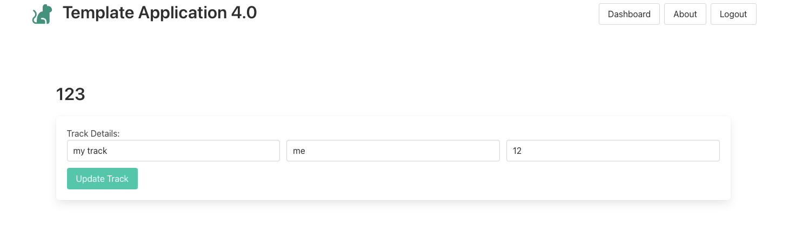
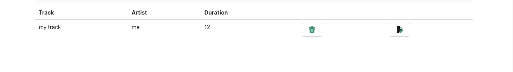

# UX 

We need a new view to support editing a track:

This displays a single track + a button to accept any edits. This will be activated via a new button to appear alongside the delete track button when listing tracks:

This is a new partial to display a single track + an update button:

## views/partials/edit-track.hbs

~~~html
{{> menu}}

<form class="box" action="/playlist/{{playlist._id}}/updatetrack/{{track._id}}" method="POST">
  <label>Track Details:</label>
  

    

      

        <input class="input" type="text" placeholder="Enter Title" name="title" value="{{track.title}}">
      

      

        <input class="input" type="text" placeholder="Enter Artist" name="artist" value="{{track.artist}}">
      

      

        <input class="input" type="text" placeholder="Enter duration" name="duration" value="{{track.duration}}">
      

    

  

  <button class="button is-primary">Update Track</button>
</form>
~~~

This is a new view to display a playlist title + the view above

## views/partials/listsongs.hbs

~~~html
{{> menu}}

<section class="section">
  

    {{playlist.title}}
  

  {{> edit-track}}
</section>
~~~

A new Icon to support editing a track:

### Partials/icons/edit.hbs

~~~handlebars
<svg width="24" height="24" fill="none" viewBox="0 0 24 24" xmlns="http://www.w3.org/2000/svg">
  <path
    d="M12 2v6a2 2 0 0 0 2 2h4.92c-.596.22-1.144.554-1.558.97l-6.05 6.092a2.815 2.815 0 0 0-.728 1.279l-.525 2.03A2.082 2.082 0 0 0 10.3 22H5.5A1.5 1.5 0 0 1 4 20.5v-17A1.5 1.5 0 0 1 5.5 2H12Z"
    fill="#212121" />
  <path
    d="M13.5 2.5V8a.5.5 0 0 0 .5.5h5.5l-6-6ZM12.196 17.572l5.902-5.902a2.285 2.285 0 1 1 3.233 3.232l-5.903 5.902a2.684 2.684 0 0 1-1.247.707l-1.831.457a1.087 1.087 0 0 1-1.318-1.318l.457-1.83c.118-.473.362-.904.707-1.248Z"
    fill="#1CA085" />
</svg>
~~~

Finally, insert this icon onto the track-list view:

### views/partials/list-tracks.hbs

~~~handlebars
<table class="table is-fullwidth">
  <thead>
    <tr>
      <th>Track</th>
      <th>Artist</th>
      <th>Duration</th>
      <th></th>
      <th></th>
    </tr>
  </thead>
  <tbody>
    {{#each playlist.tracks}}
    <tr>
      <td>
        {{title}}
      </td>
      <td>
        {{artist}}
      </td>
      <td>
        {{duration}}
      </td>
      <td>
        <a href="/playlist/{{../playlist._id}}/deletetrack/{{_id}}" class="button">
          {{>icons/delete}}
        </a>
      </td>
      <td>
        <a href="/playlist/{{../playlist._id}}/edittrack/{{_id}}" class="button">
          {{>icons/edit}}
        </a>
      </td>
    </tr>
    {{/each}}
  </tbody>
</table>
~~~

