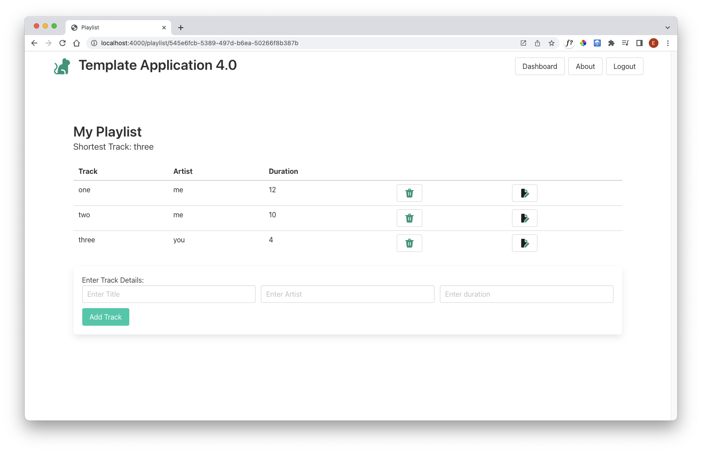

# Update the View

To display the shortest song, we need to pass the data to the view. Change the method as follows:

~~~javascript
    const viewData = {
      title: "Playlist",
      playlist: playlist,
      shortestTrack: shortestTrack,
    };
    response.render("playlist-view", viewData);
~~~

We can then change playlist.html to display this new information:

### playlist.hbs

~~~html
{{> menu}}

<section class="section">
  

    {{playlist.title}}
  

  

    Shortest Track: {{shortestTrack.title}}
  

  {{> list-tracks}}
  {{> add-track}}
</section>
~~~

We have just added this line:

~~~html
  <h4> Shortest song: {{shortestTrack.title}}</h4>
~~~

This should render like this:

