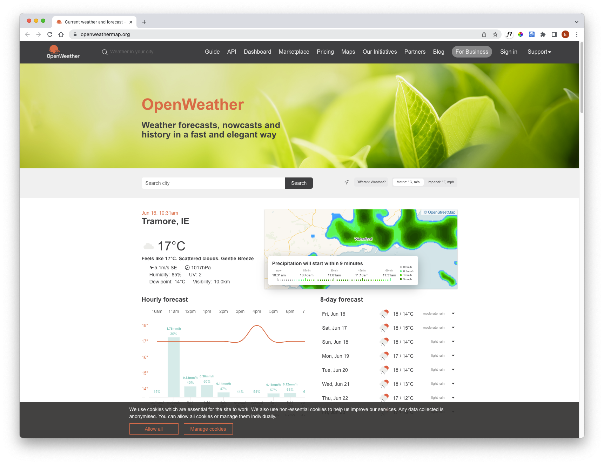
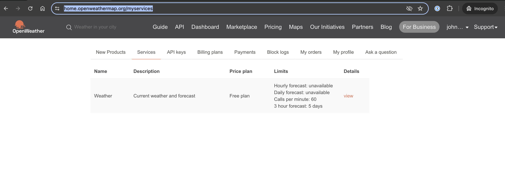
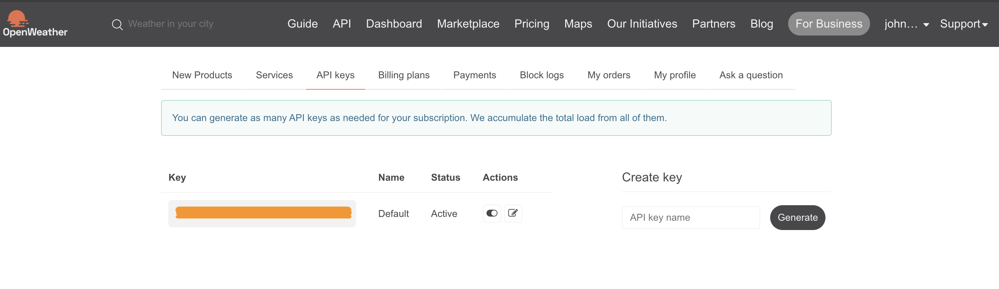
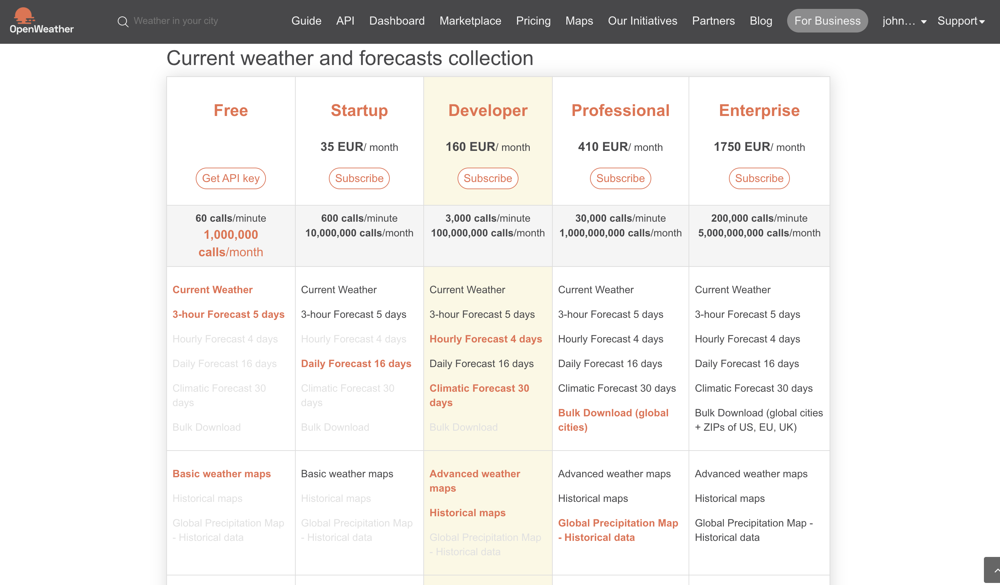

# Open Weather

Visit:

- <https://openweathermap.org>

It may show your location by default. If not, you be able to search for it.

Sign up for an account (via the sign in button) and log in if you have not already.

Now go to `https://home.openweathermap.org/myservices`

Now click the API keys tab. there should be a default there, if not, create one.

Perhaps giving it a name.

Before testing the key - have a quick look here:

- <https://openweathermap.org/faq>

In particular - look at the question:

- Do I need to activate my API key?

You key will be activated automatically in between 10 minutes & 2 hours! However, < 10 minutes seems typical

Note the areas you have access to:

* https://openweathermap.org/current
* https://openweathermap.org/forecast5

Review, what else you have access to on the free tier.
