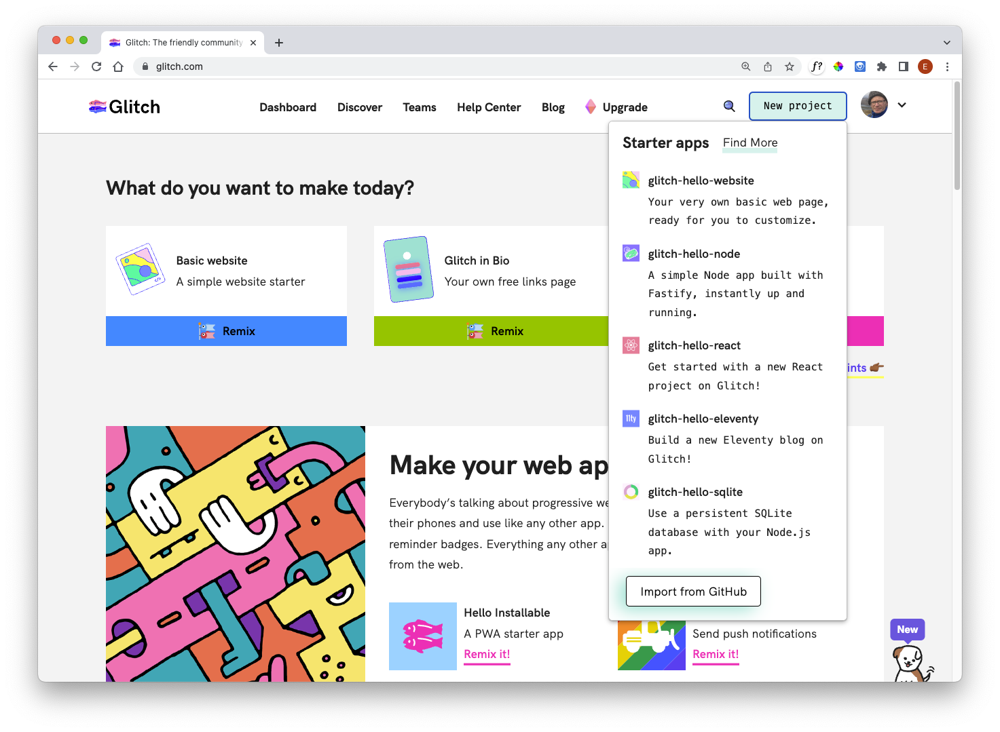
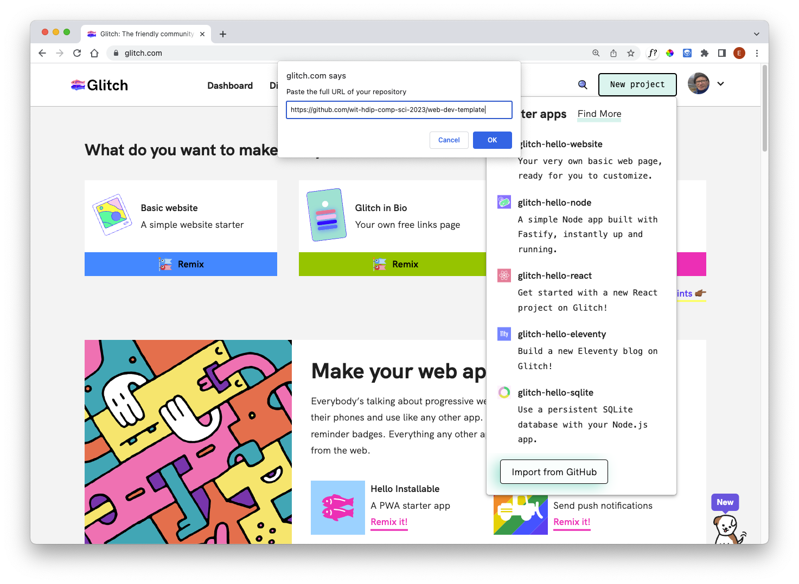
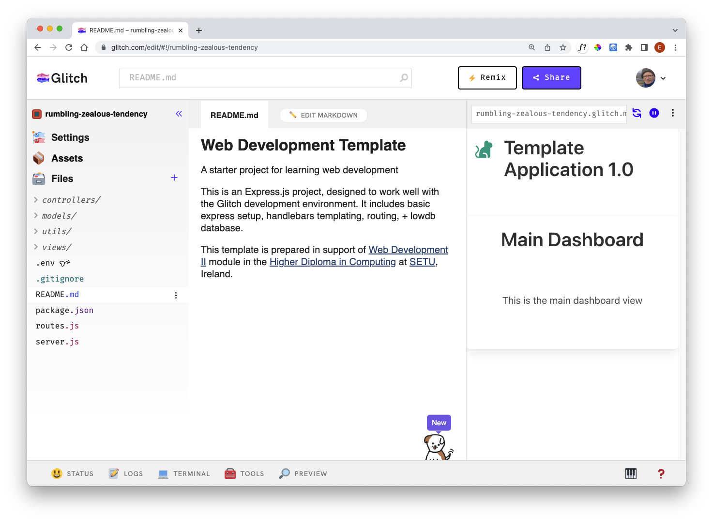

# Create Project

From the menus select `New Project`:



Press `Import from Github`:



In the dialog, enter this repo:

```bash
https://github.com/wit-hdip-comp-sci-2023/web-dev-template
```

It will take a few seconds to load:



This is the same procedure we used to create the first Playlist project in Lab 04a
