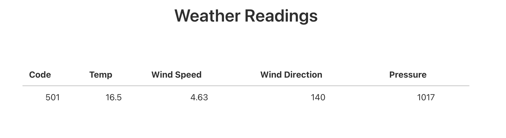
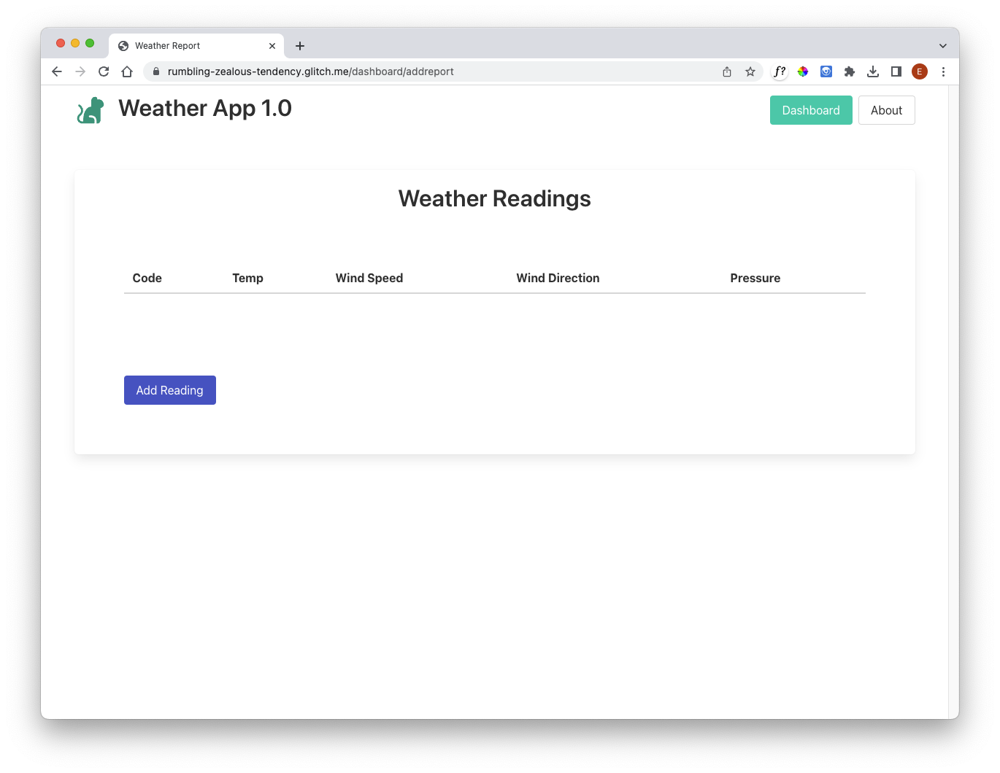

# Weather Report

We would like to present a table of readings a UX like this:

This presents a latest weather report from some location - updated when the button is pressed.

We need these new partials:

### views/partials/reading-header.hbs

~~~html
<tr>
  <th> Code </th>
  <th> Temp </th>
  <th> Wind Speed </th>
  <th> Wind Direction </th>
  <th> Pressure </th>
</tr>
~~~

#### views/partials/reading-row.hbs

~~~html
<tr>
  <td> {{reading.code}}   </td>
  <td> {{reading.temperature}} </td>
  <td> {{reading.windSpeed}} </td>
  <td> {{reading.windDirection}} </td>
  <td> {{reading.pressure}} </td>
</tr>
~~~

#### view/partials/readling-table.hbs

~~~html
<table class="table is-fullwidth">
  <thead>
    {{> reading-header }}
  </thead>
  <tbody>
    {{> reading-row }}
  </tbody>
</table>
~~~

We also need to change the dashboard-view as follows:

### views/dashboard-view.hbs

~~~handlebars
{{> menu active="dashboard"}}

<section class="box has-text-centered">
  <h3 class="is-3 title">
    Weather Readings
  </h3>
  

    {{> reading-table}}
  

  <section class="section">
    <form action="/dashboard/addreport" method="POST">
      

        <button class="button is-link">Add Reading</button>
      

    </form>
  </section>
</section>
~~~

Now add this new route:

### routes.js

~~~
router.post("/dashboard/addreport", dashboardController.addreport);
~~~

Finally, implement the action:

### controllers/dashboard-controller.js

~~~javascript
  async addreport(request, response) {
    console.log("rendering new report");
    const report = {};
    const viewData = {
      title: "Weather Report",
      reading : report
    };
    response.render("dashboard", viewData);
  },
~~~

The app should run now without any errors - although there will be no data displayed yet.

