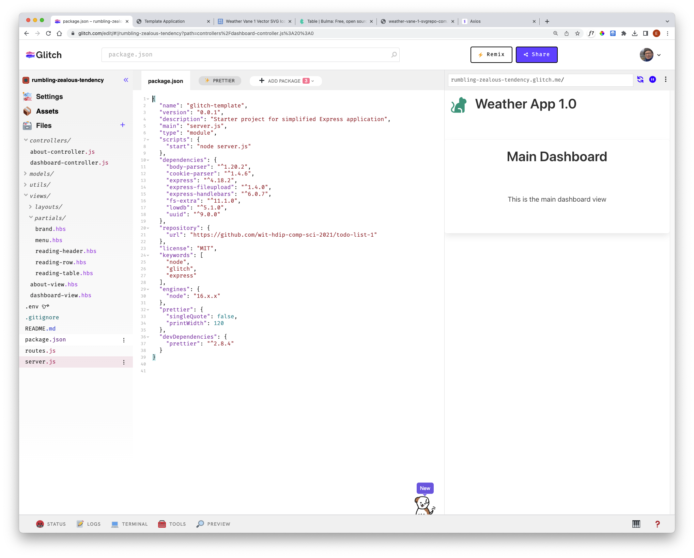
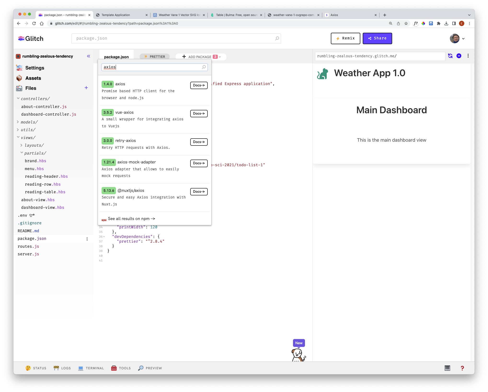

###  Axios Component

To make api requests to external services, we will use a new library component:

- https://axios-http.com/

The procedure for installing this component will be different depending on whether you are using Glitch or developing offline using WebStorm.

### Glitch

Open the package.json file:

Select `Add Package` button and enter `axios`:

Select the axios - and it will install the package. Make sure the axios appears in the package.json file:

~~~json
{
  "name": "glitch-template",
  "version": "0.0.1",
  "description": "Starter project for simplified Express application",
  "main": "server.js",
  "type": "module",
  "scripts": {
    "start": "node server.js"
  },
  "dependencies": {
    "body-parser": "^1.20.2",
    "cookie-parser": "^1.4.6",
    "express": "^4.18.2",
    "express-fileupload": "^1.4.0",
    "express-handlebars": "^6.0.7",
    "fs-extra": "^11.1.0",
    "lowdb": "^5.1.0",
    "uuid": "^9.0.0",
    "axios": "^1.4.0"
  },
  "repository": {
    "url": "https://github.com/wit-hdip-comp-sci-2021/todo-list-1"
  },
  "license": "MIT",
  "keywords": [
    "node",
    "glitch",
    "express"
  ],
  "engines": {
    "node": "16.x.x"
  },
  "prettier": {
    "singleQuote": false,
    "printWidth": 120
  },
  "devDependencies": {
    "prettier": "^2.8.4"
  }
}
~~~

### VSCode

If you are using VSCode, the procedure is slightly simpler. Open a terminal/shell in the project folder, and enter this command:

~~~bash
npm install axios
~~~

Check to see if the package.json file is updated as above.
