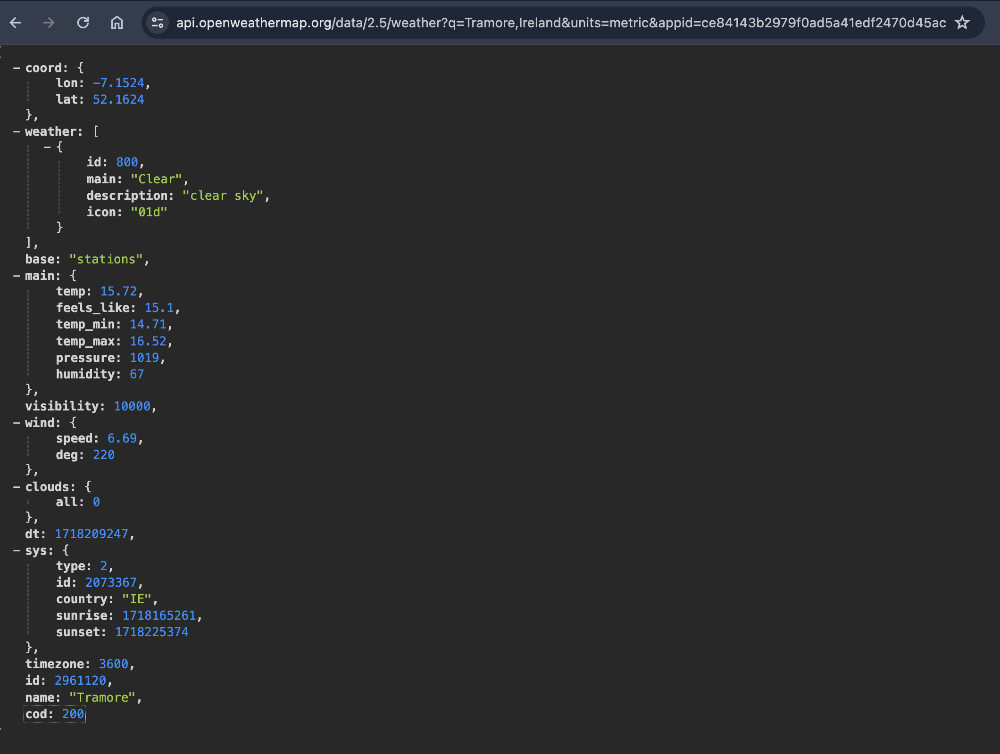
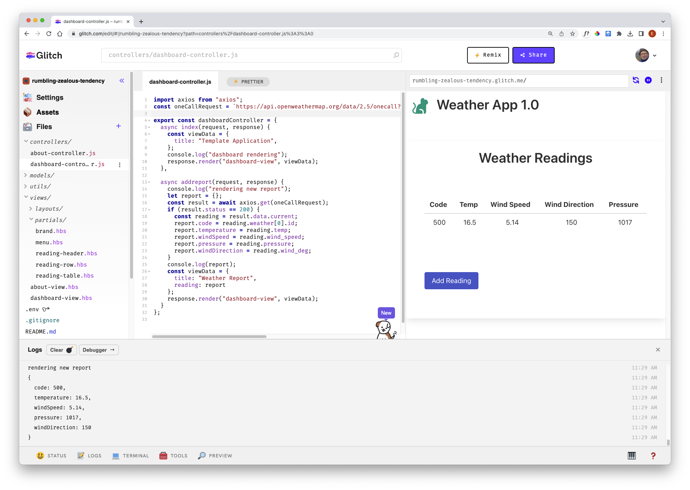

# API Request

From the last lab you should already be able to make a request to OpenWeatherApi via the browser.


```
https://api.openweathermap.org/data/2.5/weather?q=Tramore,Ireland&units=metric&appid=YOUR_API_KEY_HERE
```

Try this now - appending your OpenWeatherAPI api key as indicated above:



 We will now integrate a call to this API from our controller.

### controllers/dashboard-controller.js

First, import axios at the top:

~~~javascript
import axios from "axios";
~~~

We can define a string that hard codes the location lat/lng + our API key

~~~javascript
const weatherRequestUrl = `https://api.openweathermap.org/data/2.5/weather?q=Tramore,Ireland&units=metric&appid=YOUR_API_KEY_HERE`
~~~

Place this declaration just after the import above (make sure to include your API key). Now, in the addreport action, rework to access the API:

~~~javascript

  async addreport(request, response) {
    console.log("rendering new report");
    let report = {};
    const result = await axios.get(weatherRequestUrl);
    if (result.status == 200) {
      const currentWeather = result.data;
      report.code = currentWeather.weather[0].id;
      report.temperature = currentWeather.main.temp;
      report.windSpeed = currentWeather.wind.speed;
      report.pressure = currentWeather.main.pressure;
      report.windDirection = currentWeather.wind.deg;
    }
    console.log(report);
    const viewData = {
      title: "Weather Report",
      reading: report,
    };
    response.render("dashboard-view", viewData);
  },
~~~

Pressing the button should now retrieve the latest weather report:



Currently the location is hard coded.


