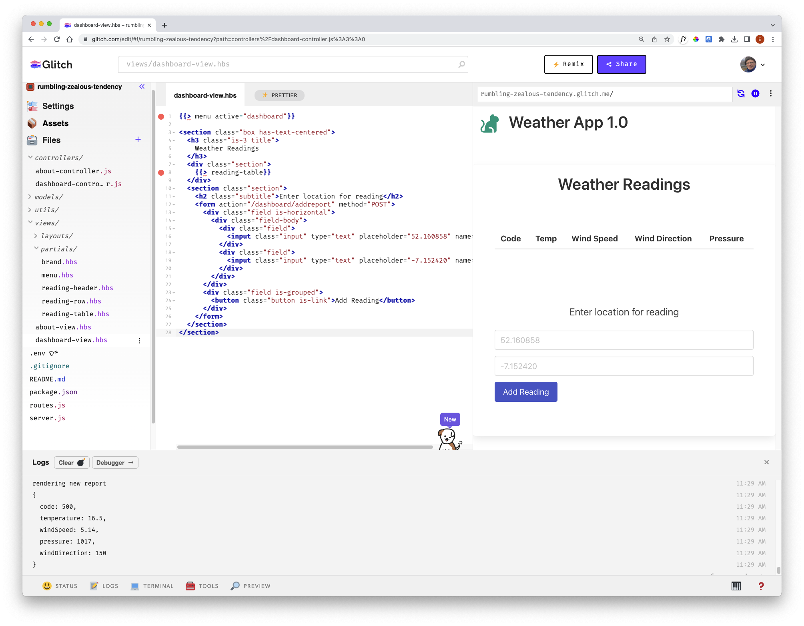

# Include Lat/Lng 

We can extend the UX to accept the lat/lng:

### views/dashboard-view.hbs

~~~handlebars
{{> menu active="dashboard"}}

<section class="box has-text-centered">
  <h3 class="is-3 title">
    Weather Readings
  </h3>
  

    {{> reading-table}}
  

  <section class="section">
    <h2 class="subtitle">Enter location for reading</h2>
    <form action="/dashboard/addreport" method="POST">
      

        

          

            <input class="input" type="text" placeholder="52.160858" name="lat">
          

          

            <input class="input" type="text" placeholder="-7.152420" name="lng">
          

        

      

      

        <button class="button is-link">Add Reading</button>
      

    </form>
  </section>
</section>
~~~

This is a revised version of the action, to get a report from the location as entered in the form:

~~~javascript
  async addreport(request, response) {
    console.log("rendering new report");
    let report = {};
    const lat = request.body.lat;
    const lng = request.body.lng;
    const latLongRequestUrl = `https://api.openweathermap.org/data/2.5/weather?lat=${lat}&lon=${lng}&units=metric&appid=YOUR_API_KEY_HERE`;
    const result = await axios.get(latLongRequestUrl);
    console.log(latLongRequestUrl)
    if (result.status == 200) {
      const currentWeather = result.data;
      report.code = currentWeather.weather[0].id;
      report.temperature = currentWeather.main.temp;
      report.windSpeed = currentWeather.wind.speed;
      report.pressure = currentWeather.main.pressure;
      report.windDirection = currentWeather.wind.deg;
    }
    console.log(report);
    const viewData = {
      title: "Weather Report",
      reading: report,
    };
    response.render("dashboard-view", viewData);
  },
~~~

The table will now display the reading from the lat/lng entered on the dashboard
