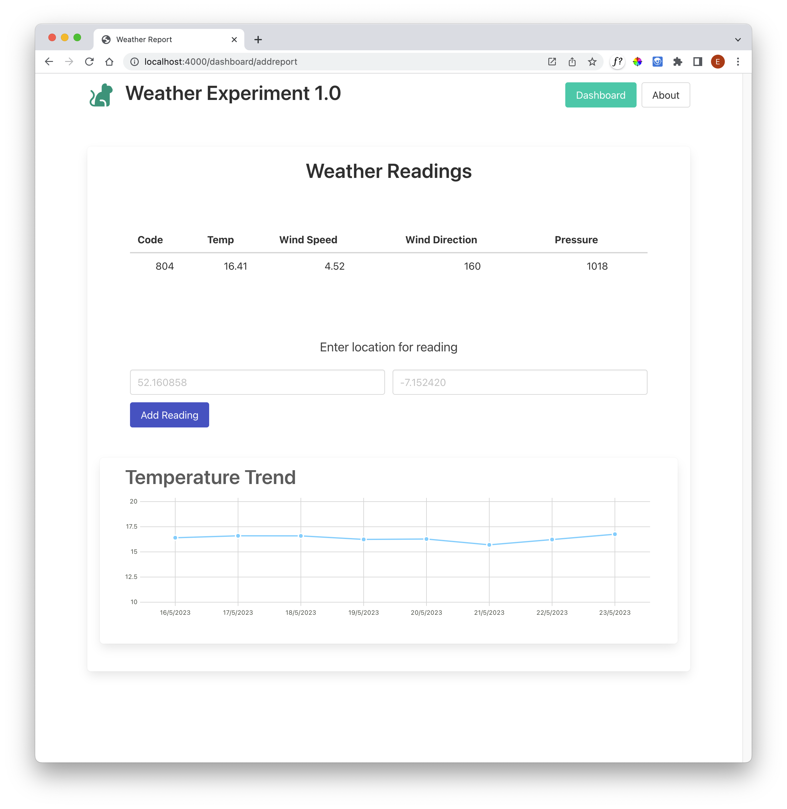

# Setup

This assumes completion of the axios lab previous;

- <https://github.com/wit-hdip-comp-sci-2024/weather-experiment>

Continue from your version of this lab or base your project on the version above.

Our objective in this lab is to acquire a set of readings from the API and display a simple temperature chart:

In the above, we have requested a report for a specific lat/lng (it will give us a series of reports over the previous week), and display these as a simple line chart.