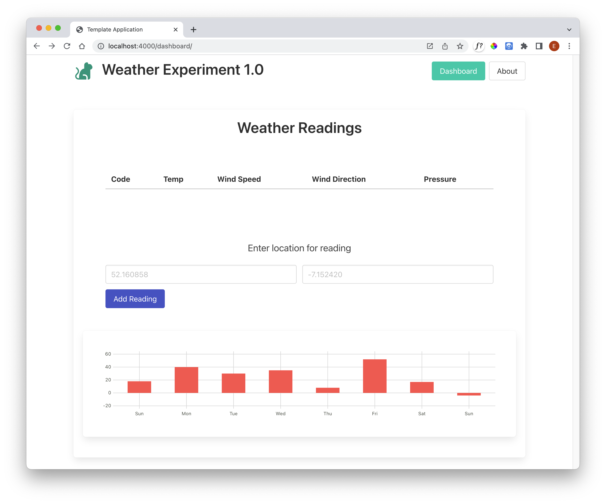

# Charts

We will use the Frappe Charts library:

- <https://frappe.io/charts>

This is a reasonably easy to use client side library, with a variety of charting options

- <https://frappe.io/charts/docs/basic/basic_chart>

This is a client side library - meaning we will be accessing it from the client (browser), and not on the server. For libraries like this, we can typically incorporate them by introducing a link to the library from the page header:

### views/layouts/main.hbs

~~~html
    
~~~

This will include this library in all our pages (like bulma)

~~~html
<!DOCTYPE html>
<html lang="en-IE">

<head>
  <meta charset="utf-8">
  <meta name="viewport" content="width=device-width, initial-scale=1">
  <title>{{title}}</title>
  <link rel="stylesheet" href="https://cdn.jsdelivr.net/npm/bulma@0.9.4/css/bulma.min.css">
   
</head>

<body>
  

    {{{body}}}
  

</body>

</html>
~~~

To see if we can get a simple chart displayed, we can copy/paste some samples from here:

- <https://frappe.io/charts/docs/basic/basic_chart>

In dasboard.hbs, append the following the end:

### # views/dashboard-view.hbs

~~~html

~~~

This should render as:

The data is the sample data we have taken from the example. Try changing to chart to a line:

~~~javascript
  new frappe.Chart("#chart", {
    data: data,
    type: "line",
    height: 180,
    colors: ["red"]
  });
~~~

Our task in this lab is to replace the constant data (& labels) :

~~~javascript
  data = {
    labels: ["Sun", "Mon", "Tue", "Wed", "Thu", "Fri", "Sat", "Sun"],
    datasets: [
      { values: [18, 40, 30, 35, 8, 52, 17, -4] }
    ]
  };
~~~

... with actual data from our API.

