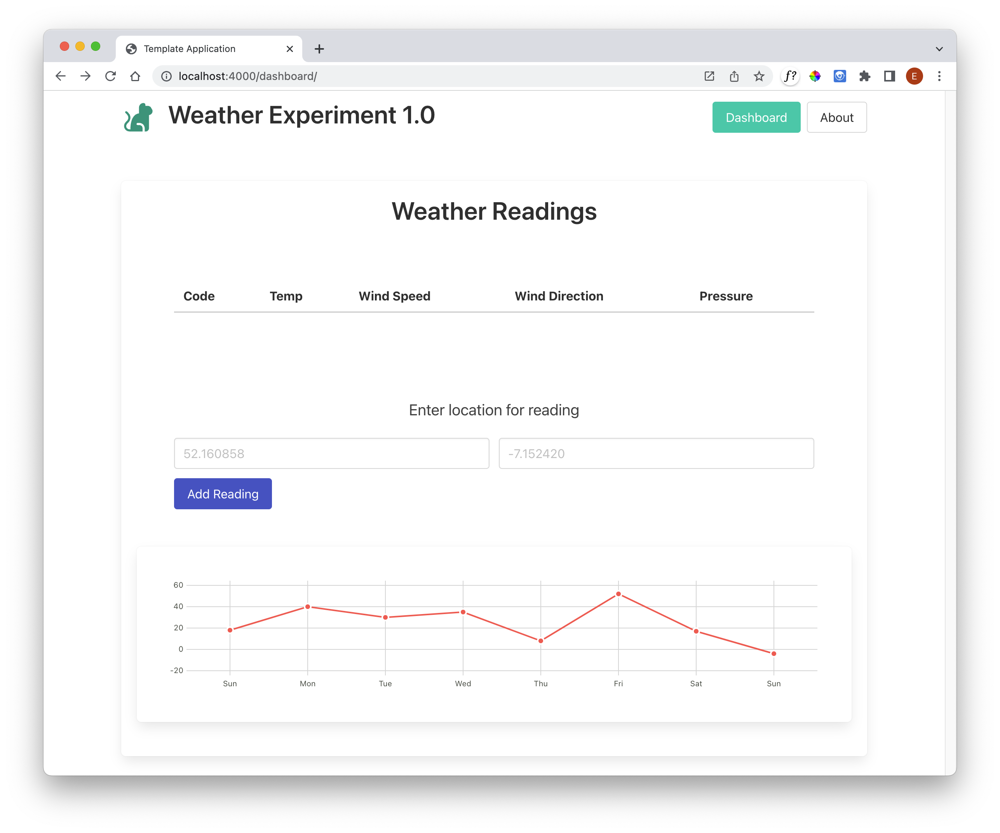
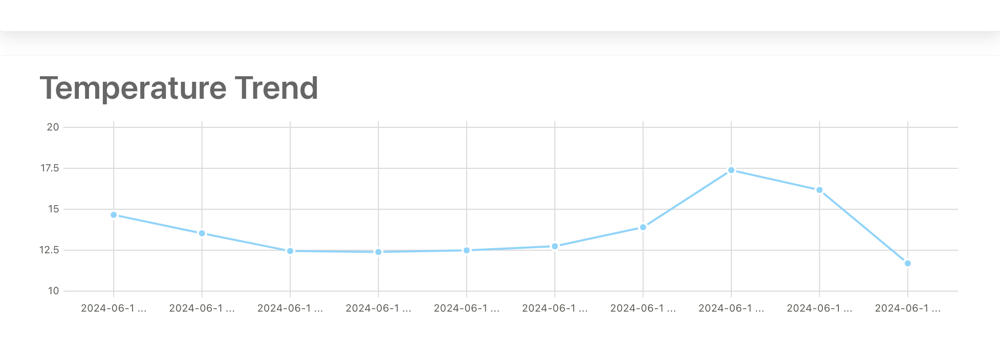
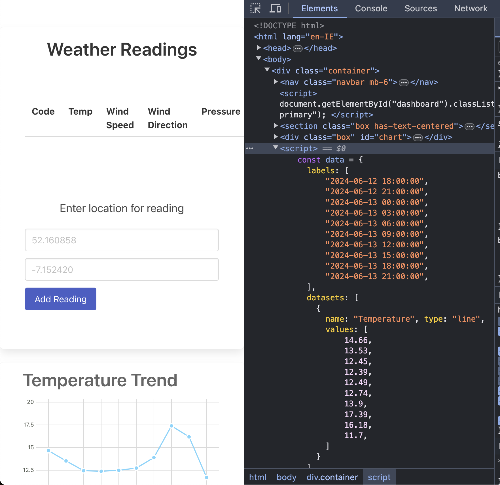

# Plotting the Data

Recall the example from the Frappe documentation:

```html
<div class="ui segment" id="chart"></div>
<script>
  data = {
    labels: ["Sun", "Mon", "Tue", "Wed", "Thu", "Fri", "Sat", "Sun"],
    datasets: [
      { values: [18, 40, 30, 35, 8, 52, 17, -4] }
    ]
  };
  new frappe.Chart("#chart", {
    data: data,
    type: "line",
    height: 180,
    colors: ["red"]
  });
</script>
```

Which renders as:



Although we have the data on the server, we need to produce exactly this data structure in the client. We can use handlebars to do this. Here is a revised `<script>` section:

~~~html
<script>
  const data = {
    labels: [
      {{#each reading.trendLabels}}
        "{{this}}",
      {{/each}}
    ],
    datasets: [
      {
        name: "Temperature", type: "line",
        values: [
          {{#each reading.tempTrend}}
            {{this}},
          {{/each}}
        ]
      }
    ]
  }

  const chart = new frappe.Chart("#chart", {
    title: "Temperature Trend",
    data: data,
    type: 'line',
    height: 250,
  })
</script>
~~~

This should render the live data as retrieved in the server (and sent to the template). 

To summarise, in the controller we are sending the weather data in the `reading` object:

### controllers/dashboard.js

~~~javascript
 async addreport(request, response) {
    console.log("rendering new report");
    let report = {};
    const lat = request.body.lat || "52.2502793";
    const lng = request.body.lng || "-7.1177689";
    const latLongRequestUrl = `https://api.openweathermap.org/data/2.5/forecast?lat=${lat}&lon=${lng}&units=metric&appid=${apiKey}`;
    const result = await axios.get(latLongRequestUrl);
    if (result.status == 200) {
      report.tempTrend = [];
      report.trendLabels = [];
      const trends = result.data.list;
      for (let i=0; i<10; i++) {
        report.tempTrend.push(trends[i].main.temp);
        report.trendLabels.push(trends[i].dt_txt);
      }
    }
    console.log(report);
    const viewData = {
      title: "Weather Report",
      reading: report,
    };
    response.render("dashboard-view", viewData);
  },
~~~

In the view, we are populating the labels and datasets arrays from this data:

~~~html
<script>
  const data = {
    labels: [
      {{#each reading.trendLabels}}
        "{{this}}",
      {{/each}}
    ],
    datasets: [
      {
        name: "Temperature", type: "line",
        values: [
          {{#each reading.tempTrend}}
            {{this}},
          {{/each}}
        ]
      }
    ]
  }
  ...
</script>
~~~

We should be able to retrieve the weather from specific locations, and plot a trend:



This mix of client and server side javascript can take a little while to get used to. It might be useful to inspect the source when running the app (client) to get a feel for what is going on:



Note however, we have now lost our ability to display the current weather. Maybe our controller could make 2 calls and put them into the report object. This is left as an exercise for the reader.
